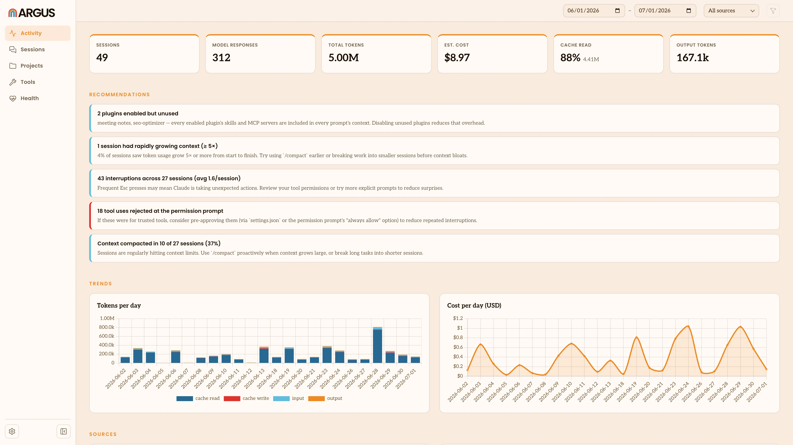

# Argus

Argus analyzes how you use your AI agents (Claude Code, Claude Cowork, Claude Chat, Codex and Gemini CLI) so you can be more productive. It's built for anyone using agents to do business tasks like account research, drafting content, editing spreadsheets and building workflows.



Argus runs locally and brings all your agent work into one place. Argus is free, [open source](LICENSE) software from [The Agent Deployment Company](https://www.agentdeployment.co).

If you're here to use Argus, [argus.agentdeployment.co](https://argus.agentdeployment.co) is the best place to learn more.

## Get started

The easiest way to run Argus is the **desktop app** — a native app that lives in your menu bar, keeps your local session data current, and opens Argus in your browser with no separate setup. The macOS build is available now; Windows is coming soon.

**→ [Download the app](https://argus.agentdeployment.co/download)**

Once it's running, look for the Argus icon in your menu bar and open it to see your usage. For a tour
of what everything means, see the [documentation](https://argus.agentdeployment.co).

## What you'll see

- Tokens and estimated cost over time
- A breakdown by source: Claude Code, Claude Cowork, Claude Chat, Codex and Gemini CLI
- The skills, tools, MCP servers, plugins, models, and projects you use most
- The tools that return the most content to your agent's context
- Per-session duration, tokens, cost, prompts, and summaries

Everything runs on your machine. Nothing is uploaded unless you choose to sync usage to an
[Argus Hub](https://argus.agentdeployment.co/argus-hub) run by your company.

## CLI

You don't need the app. Argus also ships as a command-line tool for more technical users. The
sections below are a quick reference; the [CLI Reference](https://argus.agentdeployment.co/cli-reference)
on the docs site is the full version.

The published CLI runs on Node.js 20.17 or newer. (The repository uses Bun for development and tests,
but the installed npm executable runs under Node.) Run it with `npx`:

```bash
npx @agentdeploymentco/argus serve --open
```

This starts a local web server (default `http://localhost:4242`) and opens it in your browser. Press
`Ctrl-C` to stop. Nothing leaves your machine — Argus finds and indexes your local sessions and
serves them locally.

### Web app (`serve`)

`serve` runs the interactive web app: a live local web app for exploring your usage.

```bash
npx @agentdeploymentco/argus serve --open          # http://localhost:4242
npx @agentdeploymentco/argus serve --port 8080      # choose a port (or set ARGUS_PORT)
```

| Flag | Description |
|------|-------------|
| `-p, --port <N>` | Local port to listen on (env `ARGUS_PORT`, default: `4242`) |
| `--open` | Open the web app in your browser once it's ready (macOS) |

The web app shows the whole local session store and refreshes it in the background; it does not
re-parse every transcript on each page load. Session titles use an instant heuristic summary built
from the first prompt, skills, tools, and edited files. To narrow which sources or dates land in the
store, use the `index` command's filters.

### The local store (`index`)

Argus keeps your parsed sessions in a private local store so unchanged transcripts don't need to
be reparsed on every run. `serve` and `sync` both read from it. The `index` command keeps it current:

```bash
npx @agentdeploymentco/argus index                  # read new and changed sessions (fast, incremental)
npx @agentdeploymentco/argus index --watch           # keep reading on an interval (default every 5 min)
npx @agentdeploymentco/argus index --watch --interval 15
npx @agentdeploymentco/argus status                  # show the store location and per-source counts
```

| Command | Description |
|---------|-------------|
| `index` | Read new and changed sessions into the local store. |
| `index --watch [--interval N]` | Keep reading on an interval (N minutes, default 5). Runs until `Ctrl-C`. |
| `index refresh [<id>…]` | Bare: re-read every transcript from disk (sessions no longer on disk are kept). With session id(s): re-index just those sessions. |
| `index rebuild [--force]` | Rebuild from scratch — **drops sessions no longer on disk**. Prompts for confirmation unless `--force`. |
| `index delete <id>… \| --archived` | Permanently remove sessions from the store. |

`index`, `index rebuild`, and `index refresh` accept `--source <claude|codex|gemini|cowork|all>`
to scope which transcript sources are read.

### Task interpretation

Argus can interpret each session into the **tasks** you asked for and how they turned out — a
description, the span of the session it covers, and a judged outcome (success / failure / unclear)
with a frustration signal. This runs an AI model on each session and is **on by default**, using
your local `claude` CLI unless you configure another provider.

To turn it off, set `enabled` to false in `argus.json` (under `$ARGUS_CONFIG_DIR`, macOS:
`~/Library/Application Support/argus/argus.json`):

```json
{ "taskExtraction": { "enabled": false } }
```

The model provider is the shared `llm.provider` setting (default `claude-cli`). With interpretation
enabled, `index` extracts tasks for sessions as it indexes them. To try it on specific sessions
without changing your config, force it per run:

```bash
npx @agentdeploymentco/argus index refresh <session-id> --extract-tasks true
```

`--extract-tasks <true|false>` (on `index`, `index rebuild`, and `index refresh`) overrides the
config for that run. The `claude` provider uses `claude -p` with a fast, cheap model by default and
leaves no extra session behind. The reconstructed dialogue used to judge outcomes is never stored —
only the task description and outcome are. See
[docs/internals/configuration.md](docs/internals/configuration.md) and
[docs/internals/task-interpretation.md](docs/internals/task-interpretation.md).

### Keep and analyze data over time (`sync`)

The local web app shows the sessions currently available on your machine. An
[Argus Hub](https://argus.agentdeployment.co/argus-hub) stores pushed snapshots so you can
analyze usage over time, compare users, filter the organization view, and review trends.

Configure Argus Hub, then upload your current usage with `sync`:

```bash
npx @agentdeploymentco/argus sync
```

`sync` uploads the syncable data already in the local store. If the store is stale, run `index`
first, or use `argus run` to keep indexing and uploads current automatically.
Run it regularly to keep the dashboard current and build a useful history for analysis.
Uploading the same snapshot again does not double-count it. To upload continuously, add `--watch`
(every N minutes, default 5) — it retries quietly through network drops and resumes once you're back
online:

```bash
npx @agentdeploymentco/argus sync --watch --interval 30
```

### Run as a service (`run`)

`argus run` does all three jobs in one long-running process — it reads new sessions, serves the web
app, and uploads on a schedule, against one shared store:

```bash
npx @agentdeploymentco/argus run                     # serve on :4242, index + upload every 5 min
npx @agentdeploymentco/argus run --port 8080 --index-interval 10 --sync-interval 30
```

It runs in the **foreground** and logs to standard output, so a service manager can supervise it,
capture its logs, and restart it. Each job is supervised independently: if one hiccups it restarts on
its own without stopping the others. If Hub is not configured, the upload job explains what is
missing and stops retrying. `Ctrl-C` or `SIGTERM` shuts it down cleanly.

Point your OS service manager at it. systemd (`~/.config/systemd/user/argus.service`):

```ini
[Service]
ExecStart=/usr/local/bin/argus run
Restart=on-failure
# Service managers launch with a minimal environment. Argus needs to find your home directory to
# locate transcripts and the store — set HOME (or ARGUS_HOME) explicitly.
Environment=HOME=%h
```

launchd (`~/Library/LaunchAgents/co.agentdeployment.argus.plist`): set `ProgramArguments` to
`[…/argus, run]`, with `RunAtLoad` and `KeepAlive` true.

## Data and accuracy

- **Local by default.** `serve` and `index` read transcripts and work entirely on your
  machine. Data is sent to the hosted dashboard only when you run `sync` (including `sync --watch`,
  or the upload job inside `run`).
- **Transcript locations.** Argus reads `~/.claude`, `~/.codex`, and `~/.gemini` by default.
  Override them with `CLAUDE_CONFIG_DIR`, `CODEX_HOME` or `CODEX_CONFIG_DIR`, and
  `GEMINI_CLI_HOME`.
- **Where Argus stores its own data.** By default the store and settings live under a
  per-platform app directory (macOS: `~/Library/Application Support/argus`). Set `ARGUS_HOME` to
  relocate everything: the store lands in `$ARGUS_HOME/data`, credentials and settings in
  `$ARGUS_HOME/config`. For advanced setups (e.g. the store on a separate volume), `ARGUS_DATA_DIR`
  and `ARGUS_CONFIG_DIR` override the data and config directories individually and take precedence
  over `ARGUS_HOME`.
- **Deduplication.** Resumed sessions can repeat earlier messages, and subagent transcripts
  live in nested directories. Argus walks recursively and deduplicates assistant messages by
  API message id.
- **Estimated cost.** Cost uses published API prices and may differ from subscription or plan
  billing. Override prices in `$ARGUS_CONFIG_DIR/pricing.json` (macOS: `~/Library/Application Support/argus/pricing.json`):

  ```json
  { "gpt-5.5": { "input": 5, "output": 30, "cacheRead": 0.5, "cacheWrite5m": 0, "cacheWrite1h": 0 } }
  ```

For more on privacy and what stays local, see
[Privacy and Security](https://argus.agentdeployment.co/privacy).

## Contributing

Argus is developed with [Bun](https://bun.sh). See [CONTRIBUTING.md](CONTRIBUTING.md) for setup, the
architecture, and how to run the tests.

## License

MIT — see [LICENSE](LICENSE).
