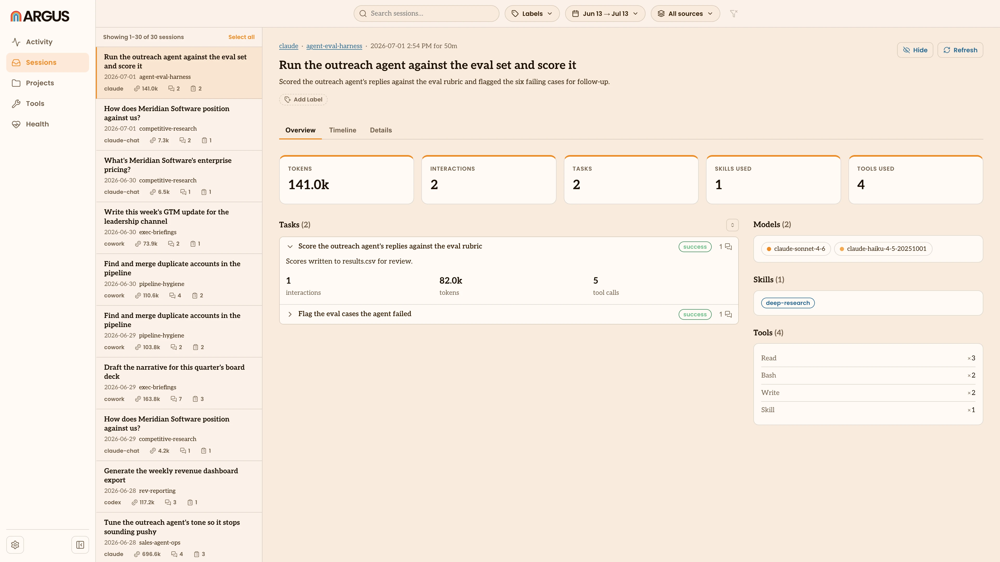
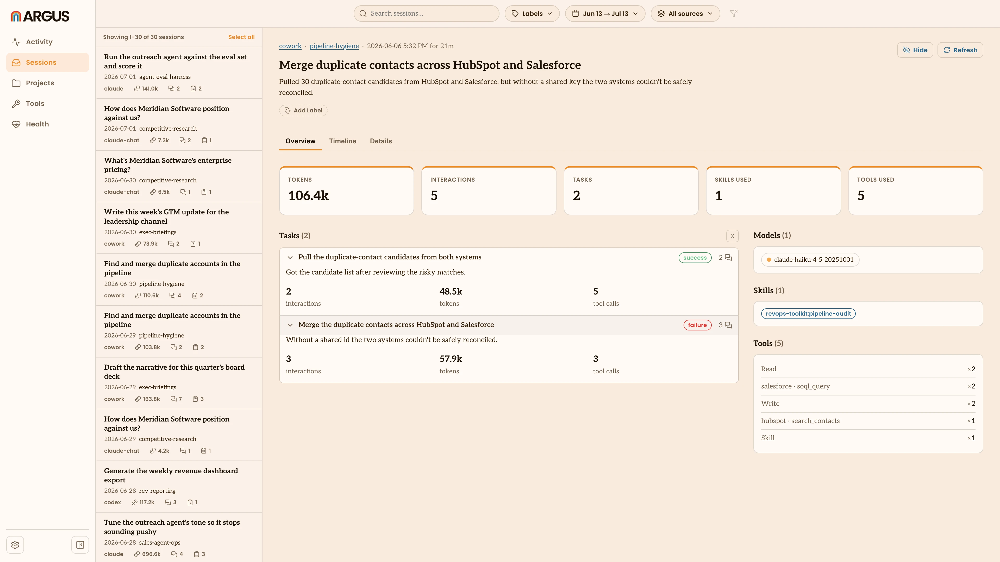
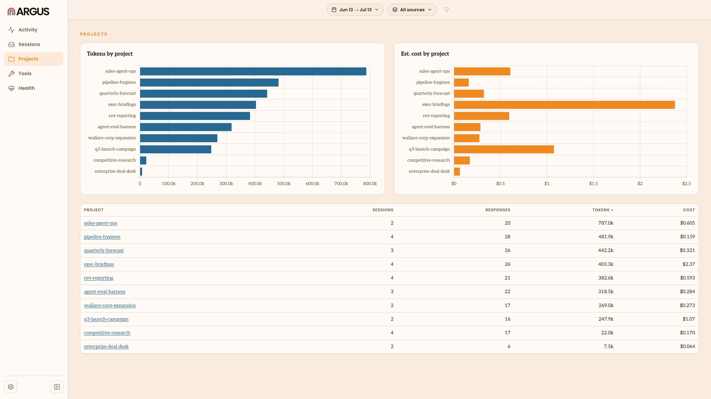
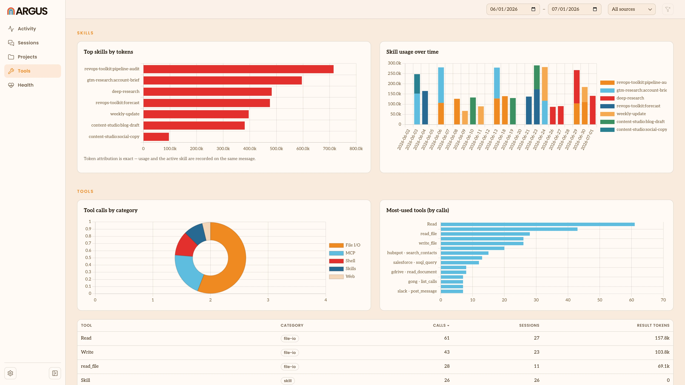

# Argus

Argus is a desktop app that helps you find and fix wasted agent work. It's built for people using
AI for business tasks. These tasks are usually more open-ended and need more external context than
coding, making for some frustrating agent interactions. Argus analyzes your AI sessions to identify
those costly, repetitive or unsuccessful tasks. It's free, open source and runs locally on Mac or
Windows. Argus works with Claude Cowork, Claude Chat, Claude Code, ChatGPT Work and Codex.


[**Try the live demo**](https://argus-demo.agentdeployment.co) ·
[**Download**](https://argus.agentdeployment.co/download) ·
[**Documentation**](https://argus.agentdeployment.co)

The demo is a read-only copy of Argus filled with sample data, so you can look around without
installing anything. Argus is from [The Agent Deployment Company](https://www.agentdeployment.co)
and is [MIT licensed](LICENSE).

## Installation

Argus is a desktop app that lives in your menu bar on macOS or your system tray on Windows. It keeps
your sessions current, opens Argus in your browser and updates itself.

**[Download for macOS or Windows](https://argus.agentdeployment.co/download)**

### Command line

Argus also ships as a command-line tool, which runs on Node.js 20.17 or
newer:

```bash
npx @agentdeploymentco/argus serve --open
```

That indexes the sessions on your machine and serves the web app at `http://localhost:4242`.

The rest of the examples use a bare `argus`, which is the command once the package is installed. It
also works through `npx`, and the desktop app bundles the same binary.

```bash
argus index --watch          # keep indexing new sessions, every 5 minutes by default
argus status                 # where the store lives, and per-source session counts
argus search "renewal"       # full-text search over titles, conversation and task text
argus search --file report   # sessions that touched a matching file path
argus run                    # index and serve in one supervised process
```

`run` also uploads on a schedule when an [Argus Hub](https://argus.agentdeployment.co/argus-hub) is
configured, which is what the desktop app runs. `config` and `secret` manage settings and stored API
keys. The [CLI Reference](https://argus.agentdeployment.co/cli-reference) covers every command and
flag.

## Features

Argus runs in your browser and provides several different ways to identify wasted work. See
[Overview](https://argus.agentdeployment.co/overview) for more.

- **[Activity](https://argus.agentdeployment.co/metric-views#activity)** is the home view: headline
  totals, recommendations and trends over time.
- **[Sessions](https://argus.agentdeployment.co/sessions)** is where you find and read individual
  sessions in depth. Search them, label them and open one to see what happened.
- **[Tasks](https://argus.agentdeployment.co/tasks)** are the things you set out to do in a session,
  each with a judged outcome.
- **[Projects](https://argus.agentdeployment.co/metric-views#projects)** groups your usage by
  project, and **[Tools](https://argus.agentdeployment.co/metric-views#tools)** shows the skills,
  tools, MCP servers and plugins your agents use.
- **[Health](https://argus.agentdeployment.co/metric-views#health)** surfaces friction: how often
  you interrupted an agent, declined a tool action or had a conversation compacted. Claude
  sessions only.
- **[Argus Hub](https://argus.agentdeployment.co/argus-hub)** pools a team's usage into one org-wide
  dashboard, if your company runs one.

| [Sessions](https://argus.agentdeployment.co/sessions) | [Tasks](https://argus.agentdeployment.co/tasks) |
| --- | --- |
|  |  |

| [Projects](https://argus.agentdeployment.co/metric-views#projects) | [Tools](https://argus.agentdeployment.co/metric-views#tools) |
| --- | --- |
|  |  |

## Architecture

Argus finds the session files your agents already write to disk, parses them and writes the result
into a local SQLite database. Nothing runs as a service and there is no account.

`index` is the only thing that writes session data. It walks each agent's directory recursively so
subagent sessions are included, deduplicates messages by API message id (resumed sessions re-append
earlier messages verbatim), and reconciles everything before storing it. `serve` reads that and
writes nothing back except your own actions, like labels and hidden sessions.

Argus interprets each session to summarize it, extract tasks and judge how they turned out. It's the
only part of Argus that sends anything to a model, and it defaults to the `claude` CLI you already
have signed in. You can point it at
[another provider](https://argus.agentdeployment.co/tasks#model-providers), a
[model gateway](https://argus.agentdeployment.co/model-gateway) or a local model, or turn it off.
See [Tasks](https://argus.agentdeployment.co/tasks) for what it captures.

The desktop app is a Tauri tray shell around this same CLI. It supervises `argus run` and proxies a
fixed local port so an open browser tab survives restarts.

## Supported agents

Argus finds these on its own, with no configuration.

| Agent | macOS | Windows |
|---|---|---|
| Claude Cowork | `~/Library/Application Support/Claude/local-agent-mode-sessions` | TBD |
| Claude Chat | `~/Library/Application Support/Claude/Cache/Cache_Data` | `%APPDATA%\Claude\Cache\Cache_Data` |
| Claude Code | `~/.claude/projects` | `%USERPROFILE%\.claude\projects` |
| ChatGPT Work and Codex | `~/.codex/sessions` | `%USERPROFILE%\.codex\sessions` |
| Gemini CLI | `~/.gemini` | `%USERPROFILE%\.gemini` |

If you've moved an agent's data with its own setting (`CLAUDE_CONFIG_DIR`, `CODEX_HOME`,
`GEMINI_CLI_HOME`), Argus follows it. ChatGPT Work and Codex share one directory, so both are read
together. See [Supported agents](https://argus.agentdeployment.co/supported-agents) for what Argus
can measure for each.

## Data and accuracy

Everything Argus builds stays in a local store. Set `ARGUS_HOME` to put it somewhere else.

Nothing is uploaded unless you run `sync` against an
[Argus Hub](https://argus.agentdeployment.co/argus-hub) your company operates, and that's off until
you configure it. Even then your prompt and response text never leaves the machine, and neither do
your API keys.

Cost is an estimate built from published API prices, so it won't match a subscription bill. Override
the prices in `pricing.json` if you need to.

For the full picture, see [Privacy and Security](https://argus.agentdeployment.co/privacy).

## Contributing

Argus is developed with [Bun](https://bun.sh) 1.2 or newer.

```bash
bun install
bun run dev          # API server and Vite, both with live reload
bun test
bun run typecheck    # also run in CI
```

See [CONTRIBUTING.md](CONTRIBUTING.md) for more, including how the pipeline fits together and how
to build the desktop app. If you're writing anything a user will read, refer to the guides in
[`docs/contributing/`](docs/contributing/).

## License

MIT, see [LICENSE](LICENSE).
