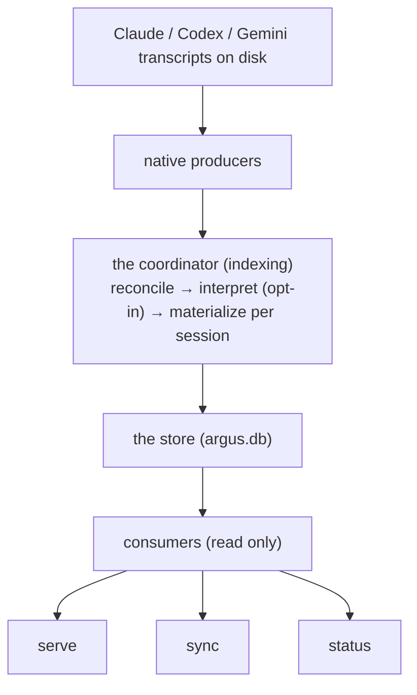

# Architecture: producers, the store, and consumers

Argus turns scattered local agent transcripts into one queryable, trusted dataset. The flow is
one-directional:

Three ideas carry the whole design:

1. **A producer owns one source.** Adding a tool is one new directory; nothing else changes.
2. **The store is reconciled at write time, never at read time.** Consumers `SELECT` finished rows.
3. **The store is a durable archive, not a mirror of disk.** Transcripts age out (~30 days); the
   store keeps what it has already read.

---

## Producers

A producer (`src/indexing/parse/producers/<id>/`) knows everything source-specific: where its sessions
live, how to read them, and what it can observe. The registry is
`src/indexing/parse/producers/index.ts` — **adding a source is a new directory plus one line there.**
The contract is `src/indexing/producer.ts`.

Producers are **native**: (`claude`, `codex`, `gemini`, `cowork`) they read local transcript files.
  - `discoverTranscripts(ctx)` — find the source's files on disk (an authoritative list, or a
    "couldn't read" result).
  - `transcriptParser()` — read one file into a fragment of *normalized facts* (sessions, messages,
    tool calls, tool results, subagent relationships).
  - `parseTranscriptPath(path)` / `discoverSessionTranscripts(path)` *(optional)* — parse one file, or
    list all of a session's transcripts from disk (Claude's main file plus its `<session>/subagents/**`
    transcripts). Used by single-session reindex so a refresh sees subagent files added since the last
    index. File layout is a producer concern.
  - `reconstructDialogue(path)` — rebuild the ordered human↔assistant **text** for a transcript, for
    the task-interpretation passes (see [task-interpretation.md](./task-interpretation.md)). This text
    is an in-memory intermediate and is never stored.
  - `discoverAuxiliary()` / `auxiliaryParser()` *(optional)* — side inputs like Claude's
    `history.jsonl` first prompts or Gemini's project roots.
  - `capabilities` — flags the reconcile engine reads generically (e.g. `canonicalizeSubagents`,
    `dedupeByProviderMessageId`) so the engine never branches on the source name.

---

## The store

One SQLite file, `argus.db` (`src/store/store.ts`). Its interface (`src/store/store-contract.ts`) is
split into two tiers — `StructuralIndexStore` (the `index_*` map) and `ReadModelStore` (the
`resolved_*` rows) — so a method's name telegraphs which tier it touches. Three layers:

1. **Structural index** — `index_files` + `index_sessions` / `index_relationships` /
   `index_auxiliary` / `index_dependencies`. A thin map of *which files exist, their fingerprints
   (for change detection), and which sessions each file maps to*. No message content. **Fully
   re-derivable from disk** — `index refresh` rebuilds it freely.

2. **Trusted read model** — `resolved_sessions` / `resolved_usage` / `resolved_interactions` /
   `resolved_invocations` / `resolved_tasks`. The finished, reconciled rows consumers read directly.
   **Not re-derivable** once a transcript ages off disk, so it is preserved across schema changes via
   real migrations (never silently dropped). `resolved_usage` (per-assistant-turn token metering) and
   `resolved_invocations` (per call+result tool use) each link to their owning interaction via
   `interaction_seq`; task membership lives on `resolved_interactions.task_seq` (a task spans the
   interactions sharing a `task_seq`, #122) — the leaf tables carry no task pointer, so token/tool
   rollups at task grain join `usage`/`invocation → interaction → task`. `resolved_tasks` holds the
   per-task interpretation (see [task-interpretation.md](./task-interpretation.md)).

3. **Bookkeeping** — `source_coverage` (per-source freshness digest) and `session_ownership`
   (which producer owns each canonical session).

**Durable archive.** When a session's transcript disappears from disk, its `resolved_*` rows are
**kept and flagged `archived`**, not deleted. The only thing that removes a retained session is the
explicit `argus index delete` command. `resolved_sessions.archived` distinguishes live (on disk) from
archived (kept after leaving disk).

---

## The coordinator: how producers feed the store

`syncStore()` in `src/indexing/pipeline.ts` is the only writer. Its job is to take what producers
parse and turn it into finished rows, using two steps — **reconcile**, then **materialize**.

### What "reconcile" means

*Reconcile* combines the raw facts a producer parsed from **all the files that make up a session**
into one correct session. A single session often spans several files: a resumed session re-appends its
earlier transcript, and subagents write their own files. Reconciling (`src/reconcile.ts`):

- **groups files by canonical session** — subagent transcripts fold onto their parent session;
- **drops duplicate messages** that replays re-append (same provider message id → first one wins);
- **orders everything onto one timeline**;
- **attaches details from side inputs** — working directory, project label, first prompt.

The result is one clean, deduplicated, fully-attributed view per session: the "figure out what
actually happened" step. It is driven by the producer's declared **capabilities** (canonicalize
subagents? dedupe by message id?), never by checking the source name — so the engine never changes when
you add a source. (`src/indexing/reconcile.ts`.)

### What "materialize" means

*Materialize* writes a reconciled session into the read-model tables (`resolved_sessions` /
`resolved_messages` / `resolved_tool_results`) as finished rows — replacing any earlier rows for that
session and recording which producer owns it (`materializeSessions` in `src/store/store.ts`). "Materialized"
means **stored as real rows a consumer can `SELECT` as-is**, not a view recomputed on every read. It is
the "save the answer" step that makes reads cheap and reconcile-free.

### What "interpret" means (opt-in)

Reconcile and materialize produce **facts** — deterministic, one-right-answer output. *Interpret*
(`src/indexing/interpret/`) is a separate, opt-in step between them that derives **interpretations**
the transcript doesn't state: it runs an AI model over a session to extract its tasks ("chapters") and
judge each task's outcome. It's
non-deterministic and costs a model call per session, so it's off by default and gated by `argus.json`.
When enabled, indexing a *changed* session also runs interpretation and attaches the tasks before the
session is materialized (so its interactions get their `task_seq`, #122). Full design:
[task-interpretation.md](./task-interpretation.md).

### Per run, per native producer

1. Discover files; **parse only the ones whose fingerprint changed** (unchanged files are skipped).
2. **Reconcile** each *touched* session; if interpretation is enabled, **interpret** the changed ones;
   then **materialize** into `resolved_*` (replacing its old rows).
3. **Archive, don't delete:** sessions the producer used to own that are no longer on disk are flagged
   `archived` and retained. (A partial re-read of a session whose files partly aged out can't shrink
   the stored copy — the fuller one wins.)

`session_ownership` tracks which producer owns each session, so a session that moves between sources
hands off cleanly without duplicating.

Both steps happen **here**, once, at write time — never on read.

### Single-session reindex

`reindexSession(id)` (`src/indexing/pipeline.ts`) re-indexes **one** session in isolation instead of a
full discovery: it rediscovers that session's transcripts from disk (the producer's
`discoverSessionTranscripts` — main file plus subagents), re-parses them, reconciles just that session
**with** its auxiliary inputs (so Claude's `firstPrompt` and Gemini's project/cwd aren't lost), and
materializes it — optionally running interpretation. It errors clearly when the session is unknown
(404) or has no local transcript, e.g. an imported session (422). It's the shared primitive behind the
CLI's `index refresh <id>` and the web Refresh.

---

## Consumers: how they read

Consumers go through `SessionStore` (`src/store/session-store.ts`), which separates the write from the
read (**CQS**): `index(query?)` brings the store current (reconcile + materialize — the only writer),
and `read(query?)` is a **pure** SQL read of `resolved_*` that never writes. Reads return the reconciled
`ParseResult` straight from the read model — **no reconciling, no re-parsing, no in-memory filtering.**
Query filters (date/project/source inputs used by API and reporting consumers) are pushed down to
SQL. Archived sessions are included, so reporting survives transcript retention.

When the real store can't be opened (missing, corrupt, incompatible schema) the two operations differ:
a **`read()` degrades** — it indexes the on-disk transcripts into a throwaway temp store and reads
that (best effort; surfaced via a `store_fallback` diagnostic, and it sees only on-disk sessions, so
archived ones are absent), while an **`index()` fails loud** — the error propagates rather than
silently writing to a temp store it then discards (which would report success having persisted
nothing, and would mask a corrupt store the user should `reindex --force`).

- `sync` — build the syncable snapshot from the current local store → upload it.
- `serve` — a pure `read()` → `aggregate.ts` path, exposed as a JSON API and an interactive web app
  (see [web-app.md](./web-app.md)). The built dashboard is cached briefly between requests.
- `status` — a read-only scan (`scanStore`) that reports per-source counts, freshness, and the totals.

Because the read model is self-sufficient, the dashboard can be produced even after the original
transcripts are gone.

---

## Command map

| Command  | Touches the store | What it does |
|----------|-------------------|--------------|
| `index`  | writes            | Read new/changed transcripts; update the store. `--watch` keeps reading on an interval. `--extract-tasks <true\|false>` overrides task interpretation for the run. |
| `index refresh [<id>…]` | rebuilds index / one session | Bare: re-read all transcripts (keeps sessions no longer on disk). With session id(s): reindex just those from disk (see single-session reindex). |
| `index rebuild` | rebuilds store | Rebuild from scratch; **drops sessions no longer on disk** (confirm, or `--force`). |
| `index delete` | deletes      | Permanently remove sessions (`<id>…` or `--archived`). |
| `serve`  | reads only        | Serve the dashboard as an interactive local web app (JSON API + SPA). Reads the already-materialized store without reconciling (the `index`/`run` legs are the sole writers). |
| `sync`   | reads             | Upload the current local store to Argus Hub. `--watch` uploads on an interval. |
| `status` | reads             | Show per-source counts, freshness, and archived totals. |
| `run`    | writes + reads    | One long-running process: `index --watch` + `serve` + `sync --watch` against one store, under one shutdown handler, each leg supervised. |

---

## Key rules

- **Reconcile at write, read raw.** Consumers never reconcile.
- **Per-session ownership.** `session_ownership` records the owning producer so a session that moves
  between sources hands off without duplicating.
- **The index is disposable; the read model is not.** `index refresh` rebuilds the index from disk;
  the trusted rows (including archived sessions) are preserved. `index rebuild` wipes everything.
- **Nothing is uploaded except by `sync`** (one-shot, `sync --watch`, or the upload leg of `run`).
  `serve` is entirely local.
- **Indexing is the only writer.** Under `run`, the index leg writes; `serve` and the upload leg only
  read. SQLite WAL makes one writer + concurrent readers safe.

## Configuration

User settings live in `argus.json` under `$ARGUS_CONFIG_DIR` (the config peer of `argus.db`), resolved
through a uniform `flag > env > argus.json > default` chain. It's the home for the task-interpretation
opt-in and provider settings. See [configuration.md](./configuration.md).

## Adding a source

1. Create `src/indexing/parse/producers/<id>/` with `index.ts` (the descriptor + capabilities) and
   `parser.ts` (discovery + parsing into normalized facts).
2. Register it in `src/indexing/parse/producers/index.ts`.

The coordinator, store, and consumers need no changes.
