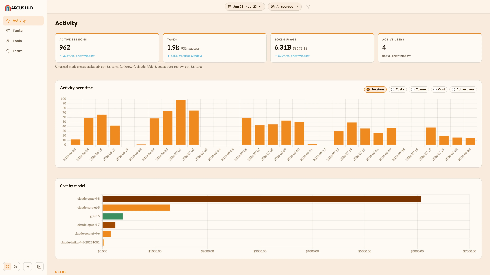

# Argus Hub

Argus Hub is a self-hosted server that collects usage data from multiple Argus clients and
presents an org-wide [dashboard](/terminology#dashboard). It is the on-premises alternative to
the hosted `argus-dash` backend.

Each person points Argus at the Hub and uses the normal [sync](/terminology#sync) command. Hub
receives the usage snapshot at `POST /api/sync`, combines it in one database and tags it by user.
Nothing is forwarded anywhere else. The raw prompt and response text stays on each person's
machine, as do their BYO model API keys.

## Set up a Hub

Hub requires Node.js 20.17 or later, or Bun 1.0 or later. Start it with:

```bash
npx @agentdeploymentco/argus-hub serve --port 4343
```

The first startup creates `data/hub.db`, generates an API key and generates an admin password.
Both values are printed once, so copy them to a secure location before closing the terminal.

The **API key** authenticates uploads from Argus clients. The **admin password** protects the
dashboard at `http://localhost:4343/login` and the Hub's read-only MCP endpoint. Set
`ADMIN_PASSWORD` before starting Hub to keep the same dashboard password across restarts. If you
do not set it, Hub generates a new password each time it starts.

::: warning Keep the credentials private
The API key allows clients to upload data. The admin password allows access to the organization's
pooled usage data. Do not put either value in source control or share them in a public channel.
:::

## Connect Argus clients

In the desktop app, open **Settings** and enter the Hub URL and API key. The app uploads on a
schedule after the connection is configured.

The app stores the key securely and shows a masked value after you save it.

<div class="screenshot">


</div>

For command-line use, save the URL in Argus and store the key in the local secret store:

```bash
npx @agentdeploymentco/argus config set hub.url https://hub.internal:4343
npx @agentdeploymentco/argus secret set ARGUS_HUB_KEY
```

The second command prompts for the key without putting it in `argus.json`. You can also configure
one process with environment variables:

```bash
export ARGUS_HUB_URL=https://hub.internal:4343
export ARGUS_HUB_KEY=hub-example-key
```

With a Hub configured, `argus sync` uploads to that Hub instead of the hosted service. No
`argus login` or OAuth flow is needed. Hub identifies a person from the client's latest identity
signal, using the Claude or Codex OAuth email when available and falling back to the local Git
name. Repeat clients from the same person are grouped together.

The desktop app syncs automatically. If you run Argus from the command line, `argus run` includes
the same upload job every five minutes by default:

```bash
npx @agentdeploymentco/argus run
```

Use `--sync-interval N` with `run` to change the interval in minutes. Use `--no-sync` when you
want to keep indexing and serving locally without uploading.

To upload one snapshot immediately:

```bash
npx @agentdeploymentco/argus sync
```

## Configure the Hub

Hub reads `hub.json` from the current directory, then environment variables, then command-line
flags. A later source takes precedence over an earlier one.

| CLI flag | Environment variable | `hub.json` key | Default | What it controls |
|---|---|---|---|---|
| `--port` | `HUB_PORT` | `port` | `4343` | Port Hub listens on |
| `--data-dir` | `HUB_DATA_DIR` | `dataDir` | `./data` | Folder containing `hub.db` |
| None | `ADMIN_PASSWORD` | None | Random | Dashboard and MCP password |
| None | `HUB_INSECURE_COOKIE_HOSTS` | None | None | Hostnames allowed to use a non-`Secure` cookie for private plain-HTTP deployments |

For example:

```json
{
  "port": 4343,
  "dataDir": "/var/lib/argus-hub"
}
```

There is no `HUB_KEY` setting. Hub stores API keys in `hub.db`. If the database has no API keys
when Hub starts, it generates a key for the Default organization and prints it to the terminal.

Only use `HUB_INSECURE_COOKIE_HOSTS` for hostnames reachable through a private network. Never list
a hostname that is reachable from the public internet.

To rotate a key, disable or remove the old key in the Hub database, then restart Hub. If no enabled
key remains, Hub generates a new one on startup. A disabled key is rejected before Hub reads the
upload body.

## Run Hub continuously

Hub runs in the foreground, so a service manager can restart it and collect its logs. The Argus
Hub repository contains the Dockerfile and the complete service examples. The common deployment
shapes are below.

### Linux with systemd

Save this as `/etc/systemd/system/argus-hub.service`:

```ini
[Unit]
Description=Argus Hub
After=network.target

[Service]
Type=simple
ExecStart=npx @agentdeploymentco/argus-hub serve --port 4343
WorkingDirectory=/srv/argus-hub
Environment=HUB_DATA_DIR=/srv/argus-hub/data
Restart=on-failure
RestartSec=5

[Install]
WantedBy=multi-user.target
```

Enable and follow it with:

```bash
sudo systemctl enable --now argus-hub
sudo journalctl -fu argus-hub
```

Set `ADMIN_PASSWORD` in the service environment so a restart does not change the dashboard
password.

### Docker

Build the image and persist `/data`, which contains `hub.db`:

```bash
docker build -t argus-hub .
docker run -d \
  --name argus-hub \
  -p 4343:4343 \
  -v argus-hub-data:/data \
  argus-hub
```

Pass `ADMIN_PASSWORD` with `-e` or an env file. The image exposes `GET /healthz`, which returns
`200 ok` without authentication for container health checks and Kubernetes liveness probes.

For Docker Compose, persist the same data volume:

```yaml
services:
  argus-hub:
    build: .
    restart: unless-stopped
    ports:
      - "4343:4343"
    volumes:
      - argus-hub-data:/data

volumes:
  argus-hub-data:
```

### macOS with launchd

Create a LaunchAgent at `~/Library/LaunchAgents/co.agentdeployment.argus-hub.plist`, set its
working directory and `HUB_DATA_DIR`, then load it:

```bash
launchctl load ~/Library/LaunchAgents/co.agentdeployment.argus-hub.plist
```

Use the service definition in the [Argus Hub repository](https://github.com/Agent-Deployment-Co/argus-hub)
for the complete plist, including log paths and restart behavior.

## Use the dashboard

Open the Hub URL in a browser. The dashboard uses the same views as `argus serve`, with a user
dimension added:

<div class="screenshot">



</div>

| View | What you can see |
|---|---|
| Activity | Usage and cost for the whole organization or one person |
| Sessions | Sessions filtered to the whole organization or one person |
| Projects | Project activity across the organization or for one person |
| Tools | Tool and MCP server usage across the organization or for one person |
| Health | Health signals for the selected scope |
| Users | Per-user sessions, tokens, estimated cost and last-sync time |

The user picker appears after at least one client syncs. Leave it on **All users** for an
organization-wide view, or choose one person to scope the views. The Users table can be sorted by
any column.

## Query Hub from an agent

Hub provides a read-only [MCP](https://modelcontextprotocol.io) endpoint at `POST /mcp`. It uses
the stateless Streamable HTTP transport, so an MCP client sends JSON-RPC requests directly over
HTTPS without a subprocess or a session.

| Tool | What it answers |
|---|---|
| `query_activity` | Usage and cost over a time window, including the previous window for comparison |
| `query_tasks` | A paged, filterable list of extracted tasks |
| `query_task_quality` | Success, frustration and interruption rates, outcomes over time and failure signals |
| `query_tool_usage` | Which tools and MCP servers people use |
| `query_users` | User IDs, display names, emails, last-sync time, sessions, tokens and cost |

The first four query tools accept `since`, `until`, `project`, `source` and `user` filters. The
`source` filter accepts `claude`, `codex`, `gemini` or `cowork`. `query_users` takes no arguments
and can help you find a `userId` before scoping another query.

Authenticate with the Hub admin password:

```text
Authorization: Bearer <admin-password>
```

For Claude Code, add the endpoint with:

```bash
claude mcp add --transport http argus-hub https://hub.internal:4343/mcp \
  --header "Authorization: Bearer <admin-password>"
```

Treat the admin password as a shared read credential after you give it to an agent. Anyone who
holds it can query the organization's activity, tasks and tool usage. If Hub runs without
`ADMIN_PASSWORD`, the MCP route is open, so set a password for any shared or network-accessible
deployment.

## Export Hub data

`argus-hub export snowflake` creates a consistent Snowflake-ready snapshot of the live Hub
database. Add `--load` to upload it with the built-in connector, or use the generated JSONL files
and `load.sql` for a manual or scheduled load.

See [Export Argus Hub data to Snowflake](https://github.com/Agent-Deployment-Co/argus-hub/blob/main/docs/snowflake.md)
for data coverage, setup, authentication, scheduling and limitations.

## Keep a Hub private

Place Hub behind a VPN or a reverse proxy with TLS. Do not expose it directly to the internet.
The Hub database contains the session data of every syncing user, so restrict filesystem access
and include it in backups. Hub sets new database files to mode `0600`.

The client sends resolved usage rows, session summaries, tasks, interaction metadata, tool and MCP
invocations and labels. It does not send retained prompt and response text or BYO API keys. The
client's local `argus.db` file never leaves the machine as a file.

## How data moves

```text
Argus clients --POST /api/sync--> Hub ingest --> hub.db
                                      |
                                      +--> dashboard and MCP queries
```

Hub supports multiple organizations. Each API key belongs to one organization. Run separate Hub
instances when unrelated tenants need strict isolation.

## License

Argus Hub is licensed under the [Functional Source License 1.1](https://github.com/Agent-Deployment-Co/argus-hub/blob/main/LICENSE),
which converts to MIT two years after each release. You can use, modify, distribute and build on
Hub for personal, internal or commercial purposes. For the first two years, you cannot run a paid
hosted service whose primary offering is Argus Hub as a service. The restriction does not cover a
larger product where agent-usage reporting is a small feature.

See the [Argus Hub repository](https://github.com/Agent-Deployment-Co/argus-hub) for releases,
the full deployment examples and support information.
