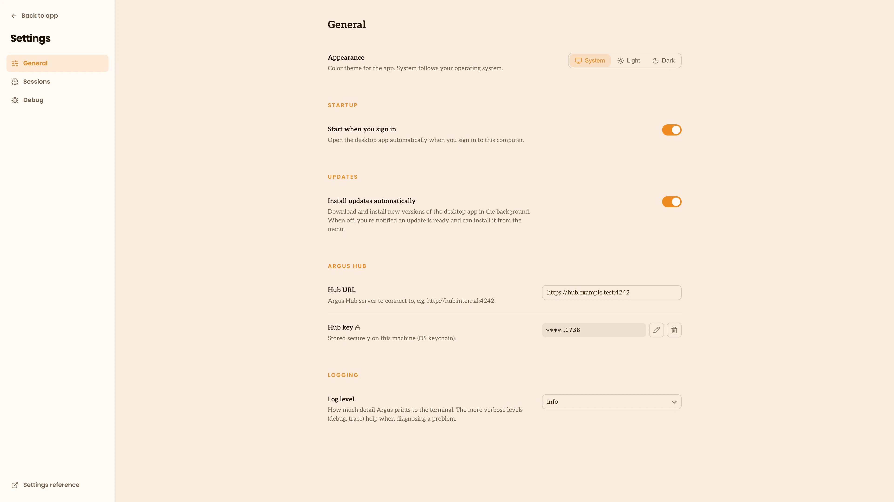

# Argus Hub

Argus Hub is a self-hosted server that collects usage data from many people's Argus and
presents an org-wide [dashboard](/terminology#dashboard).

Each person points their Argus at an Argus Hub. The Hub receives usage metrics and
task data from each one, along with short snippets like a session's opening prompt
and the brief evidence behind a task's judgment. It never receives the full text of
your sessions. It merges everything into one central database tagged by user and
serves an org-wide view.

## Set up the connection

Open **Settings**, then enter the Hub URL and Hub key under **Argus Hub**. Argus stores
the key securely on your computer and masks it after you save it.

## Sending data to Argus Hub

The desktop app uploads automatically on a schedule once you point it at an Argus Hub, so
most people don't run anything by hand. If you use the command line, `argus run` includes the
same built-in [sync](/terminology#sync) (every 5 minutes by default); pass `--sync-interval N` to
change the frequency, or `--no-sync` to skip uploads entirely.

Run `argus sync` to upload manually.

## More information

See the [Argus Hub repository](https://github.com/Agent-Deployment-Co/argus-hub) for installation instructions and release downloads.
