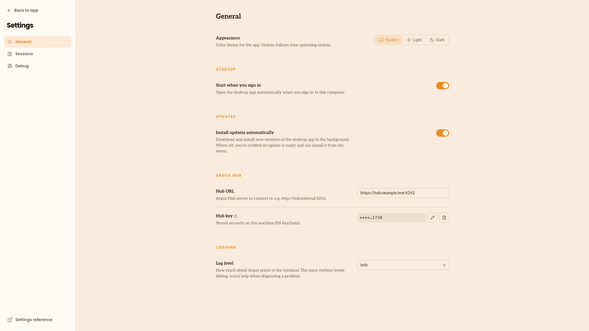

# Argus Hub

Argus Hub is a self-hosted server that collects usage data from multiple Argus clients and
presents an org-wide [dashboard](/terminology#dashboard). Your company runs it on your own
network; nothing about it is hosted for you.

Each person points Argus at the Hub and uses the normal [sync](/terminology#sync) command. Hub
receives the usage snapshot at `POST /api/sync`, combines it in one database and tags it by user.
Nothing is forwarded anywhere else. The raw prompt and response text stays on each person's
machine, as do their BYO model API keys.

## Set up a Hub

Hub requires Node.js 20.17 or later, or Bun 1.0 or later. Generate a secret key and start it with:

```bash
export HUB_SECRET_KEY="$(openssl rand -base64 32)"  # save this value
npx @agentdeploymentco/argus-hub serve --port 4343
```

The first startup creates `data/hub.db`, generates an API key and generates an admin password.
Both values are printed once, so copy them to a secure location before closing the terminal.

The **API key** authenticates uploads from Argus clients. The **admin password** protects the
dashboard at `http://localhost:4343/login` and the Hub's read-only MCP endpoint. Set
`ADMIN_PASSWORD` before starting Hub to keep the same dashboard password across restarts. If you
do not set it, Hub generates a new password each time it starts.

`HUB_SECRET_KEY` is optional, but without it Hub starts with a warning and disables API-key-based
task LLM providers in **Settings**, since it has nothing to encrypt those keys with in `hub.db`.
Set it once, keep it stable across restarts, and back it up separately from `hub.db`: losing it
makes any provider keys already stored there unreadable.

::: warning Keep the credentials private
The API key allows clients to upload data. The admin password allows access to the organization's
pooled usage data. Do not put either value in source control or share them in a public channel.
:::

## Connect Argus clients

In the desktop app, open **Settings** and enter the Hub URL and API key. The app uploads on a
schedule after the connection is configured.

The app stores the key securely and shows a masked value after you save it.

<div class="screenshot">



</div>

For command-line use, save the URL in Argus and store the key in the local secret store:

```bash
npx @agentdeploymentco/argus config set hub.url https://hub.internal:4343
npx @agentdeploymentco/argus secret set ARGUS_HUB_KEY
```

The second command prompts for the key without putting it in `argus.json`. You can also configure
one process with environment variables:

```bash
export ARGUS_HUB_URL=https://hub.internal:4343
export ARGUS_HUB_KEY=hub-example-key
```

With a Hub configured, `argus sync` uploads to that Hub instead of the hosted service. No
`argus login` or OAuth flow is needed. Hub identifies a person from the client's latest identity
signal, using the Claude or Codex OAuth email when available and falling back to the local Git
name. Repeat clients from the same person are grouped together.

The desktop app syncs automatically. If you run Argus from the command line, `argus run` includes
the same upload job every five minutes by default:

```bash
npx @agentdeploymentco/argus run
```

Use `--sync-interval N` with `run` to change the interval in minutes. Use `--no-sync` when you
want to keep indexing and serving locally without uploading.

To upload one snapshot immediately:

```bash
npx @agentdeploymentco/argus sync
```

## Configure the Hub

Hub reads `hub.json` from the current directory, then environment variables, then command-line
flags. A later source takes precedence over an earlier one.

| CLI flag | Environment variable | `hub.json` key | Default | What it controls |
|---|---|---|---|---|
| `--port` | `HUB_PORT` | `port` | `4343` | Port Hub listens on |
| `--data-dir` | `HUB_DATA_DIR` | `dataDir` | `./data` | Folder containing `hub.db` |
| None | `HUB_SECRET_KEY` | None | None | Base64 encoding of 32 random bytes; encrypts task LLM provider keys stored in `hub.db`. Without it, those providers stay disabled |
| None | `ADMIN_PASSWORD` | None | Random | Dashboard and MCP password |
| None | `HUB_INSECURE_COOKIE_HOSTS` | None | None | Hostnames allowed to use a non-`Secure` cookie for private plain-HTTP deployments |

For example:

```json
{
  "port": 4343,
  "dataDir": "/var/lib/argus-hub"
}
```

There is no `HUB_KEY` setting. Hub stores API keys in `hub.db`. If the database has no API keys
when Hub starts, it generates a key for the Default organization and prints it to the terminal.

Only use `HUB_INSECURE_COOKIE_HOSTS` for hostnames reachable through a private network. Never list
a hostname that is reachable from the public internet.

To rotate a key, delete the old key's row from the Hub database, then restart Hub. Hub only
generates a new key when the `api_keys` table is empty, so disabling a key with `is_enabled = 0`
does not trigger this: rotation requires removing the row outright, not just disabling it. A
disabled key is rejected before Hub reads the upload body.

## Run Hub continuously

Hub runs in the foreground, so a service manager can restart it and collect its logs. The Argus
Hub repository contains the Dockerfile and the complete service examples. The common deployment
shapes are below.

### Linux with systemd

Save this as `/etc/systemd/system/argus-hub.service`:

```ini
[Unit]
Description=Argus Hub
After=network.target

[Service]
Type=simple
ExecStart=npx @agentdeploymentco/argus-hub serve --port 4343
WorkingDirectory=/srv/argus-hub
Environment=HUB_DATA_DIR=/srv/argus-hub/data
Restart=on-failure
RestartSec=5

[Install]
WantedBy=multi-user.target
```

Enable and follow it with:

```bash
sudo systemctl enable --now argus-hub
sudo journalctl -fu argus-hub
```

Set `ADMIN_PASSWORD` in the service environment so a restart does not change the dashboard
password.

### Docker

Pull the published image and persist `/data`, which contains `hub.db`:

```bash
docker pull ghcr.io/agent-deployment-co/argus-hub:latest
docker run -d \
  --name argus-hub \
  -p 4343:4343 \
  -v argus-hub-data:/data \
  --env-file hub.env \
  ghcr.io/agent-deployment-co/argus-hub:latest
```

The package is public, so no `docker login` is needed to pull it. Prefer pinning to a specific
`<version>` or `sha-<commit>` tag over `latest` outside local testing. Building the image
yourself (`docker build -t argus-hub .`) works the same way if you'd rather not pull a
prebuilt image.

`hub.env` should hold at least `HUB_SECRET_KEY` (see [Set up a Hub](#set-up-a-hub)) and, if you
want it pinned, `ADMIN_PASSWORD`. The image exposes `GET /healthz`, which returns `200 ok`
without authentication for container health checks and Kubernetes liveness probes.

For Docker Compose, persist the same data volume:

```yaml
services:
  argus-hub:
    image: ghcr.io/agent-deployment-co/argus-hub:latest
    restart: unless-stopped
    ports:
      - "4343:4343"
    env_file:
      - hub.env
    volumes:
      - argus-hub-data:/data

volumes:
  argus-hub-data:
```

### macOS with launchd

Create a LaunchAgent at `~/Library/LaunchAgents/co.agentdeployment.argus-hub.plist`, set its
working directory and `HUB_DATA_DIR`, then load it:

```bash
launchctl load ~/Library/LaunchAgents/co.agentdeployment.argus-hub.plist
```

Use the service definition in the [Argus Hub repository](https://github.com/Agent-Deployment-Co/argus-hub)
for the complete plist, including log paths and restart behavior.

## Use the dashboard

Open the Hub URL in a browser. The dashboard groups organization-wide usage into five views,
each covered in depth under **Using Argus Hub** in the nav:

<div class="screenshot">


</div>

| View | What you can see |
|---|---|
| [Activity](/hub-activity) | Usage and cost for the whole organization, trended against the prior window |
| [Tasks](/hub-tasks) | Extracted tasks, outcomes, frustration and friction, top failure signals |
| [Tools](/hub-tools) | Tool, skill and MCP server usage across the organization |
| [Team](/hub-team) | Per-user sessions, tokens, estimated cost, last-sync time and groups |
| Labels | Hub-wide task labels — create, apply and remove them; see [Hub labels](/hub-tasks#hub-labels) |
| [Export](/hub-export) | Download the full dataset, or load it into Snowflake |

The group picker appears after at least one client syncs and someone has been put in a group.
Leave it on **All** for an organization-wide view, or choose a group to scope Activity, Tasks and
Tools. The Team table lists everyone by group, and clicking a row opens that person's own
activity view.

**Settings** holds the task LLM provider Hub will use for organization-level task labeling.
Nothing in Hub calls this provider yet beyond a **Test connection** check on the Settings page
itself; it's reserved for a future feature. Any API key you save there is encrypted in `hub.db`
with `HUB_SECRET_KEY`.

## Query Hub from an agent

Hub also provides a read-only-by-default [MCP](https://modelcontextprotocol.io) endpoint at
`POST /mcp`, so an agent can query activity, tasks and tool usage directly. See
[Query Hub from an agent](/hub-mcp) for the full tool list, filters, authentication and a worked
example.

## Export Hub data

`argus-hub export snowflake` creates a consistent Snowflake-ready snapshot of the live Hub
database, from the dashboard or the command line. See [Export](/hub-export) for both paths and
the Snowflake load flow.

## Keep a Hub private

Place Hub behind a VPN or a reverse proxy with TLS. Do not expose it directly to the internet.
The Hub database contains the session data of every syncing user, so restrict filesystem access
and include it in backups. Hub sets new database files to mode `0600`.

The client sends resolved usage rows, session summaries, tasks, interaction metadata, tool and MCP
invocations and labels. It does not send retained prompt and response text or BYO API keys. The
client's local `argus.db` file never leaves the machine as a file.

## Data flow

```text
Argus clients --POST /api/sync--> Hub ingest --> hub.db
                                      |
                                      +--> dashboard and MCP queries
```

Hub supports multiple organizations. Each API key belongs to one organization. Run separate Hub
instances when unrelated tenants need strict isolation.

## License

Argus Hub is licensed under the [Functional Source License 1.1](https://github.com/Agent-Deployment-Co/argus-hub/blob/main/LICENSE),
which converts to MIT two years after each release. You can use, modify, distribute and build on
Hub for personal, internal or commercial purposes. For the first two years, you cannot run a paid
hosted service whose primary offering is Argus Hub as a service. The restriction does not cover a
larger product where agent-usage reporting is a small feature.

See the [Argus Hub repository](https://github.com/Agent-Deployment-Co/argus-hub) for releases,
the full deployment examples and support information.
