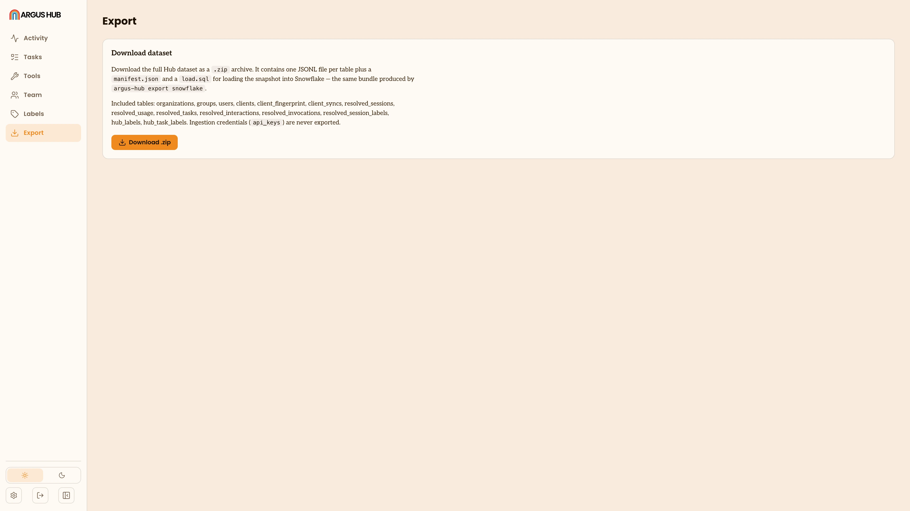

# Argus Hub: Export

Export gives you the Argus Hub's full dataset as a Snowflake-ready bundle,
either from the dashboard or the command line. Both paths produce the same
contents; the CLI adds the option to load it straight into Snowflake.

## From the browser

Open **Export** and click the download button. Your browser streams a zip
straight to disk, so Argus Hub never has to hold the whole archive in memory to
serve it.

The zip contains one JSONL file per table (organizations, groups, users,
clients, sessions, usage, tasks, interactions, invocations, session labels
and Argus Hub labels), a `manifest.json` with the schema version and a row count
per table, and a `load.sql` with the Snowflake DDL and load statements for
every table. API keys are never included, in the zip or anywhere else.

<div class="screenshot">



</div>

## From the command line

```bash
npx @agentdeploymentco/argus-hub export snowflake
```

Without `--load`, this writes the same bundle to a timestamped folder and
prints where `load.sql` landed. Point `--data-dir` at the Argus Hub's data
folder if you're not running the command from the Argus Hub's working directory.

Add `--load` to upload the bundle and swap it into Snowflake directly,
passing the connection details:

```bash
npx @agentdeploymentco/argus-hub export snowflake --load \
  --account your-account \
  --username your-user \
  --database ARGUS_HUB \
  --schema ARGUS_HUB \
  --warehouse your-warehouse \
  --authenticator SNOWFLAKE_JWT \
  --private-key-path /path/to/key.p8
```

Credentials (password, token, key passphrase) are read from the
environment, never passed as a flag. Key-pair authentication is the
recommended choice for a scheduled or unattended load, and browser SSO
only works interactively.

Each load replaces a table's contents in full: stage the new rows, delete
the old ones, insert the new ones, all inside one transaction. It's a
snapshot replace, not an incremental or change-data-capture load, so
running it again fully supersedes the last load rather than appending to
it.

See [Export Argus Hub data to Snowflake](https://github.com/Agent-Deployment-Co/argus-hub/blob/main/docs/snowflake.md)
in the Argus Hub repository for the full flag reference, authentication
options and known limitations, including that exported files can contain
personal data (emails, prompts, summaries) and should be handled with the
same care as the Argus Hub's own database.
