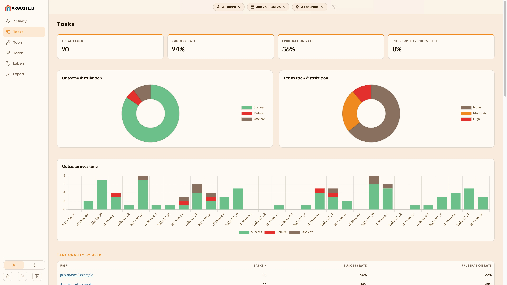
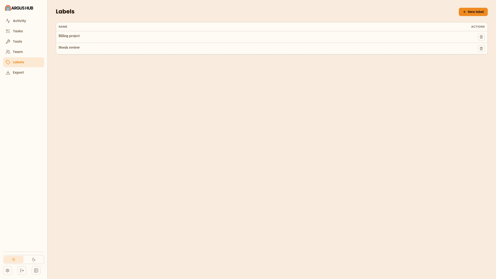

# Argus Hub: Tasks

Argus Hub's Tasks view takes the same per-session [task](/terminology#task)
extraction described in [Tasks](/tasks), a task's description, its outcome
and how much friction it took, and rolls it up across everyone syncing to
the Argus Hub. Where the single-client Tasks view shows one session at a time,
this view is for spotting patterns: which projects or people are hitting
trouble, and what's causing it.

## Filters

The same filter bar as [Activity](/argus-hub/activity): date range, source,
group. This view adds two filters of its own: a free-text search over task
descriptions and projects, and an outcome filter (success, failure,
unknown) you can combine with it.

## Headline totals

Four stat cards: **Total tasks**, **Success rate**, **Frustration rate** and
**Interrupted rate**. Each rate is a share of the tasks with a clear
reading. A task Argus couldn't classify doesn't count against you, and a
card reads as unavailable (`—`) rather than 0% when nothing in the window
has a clear reading yet.

## Outcome and frustration

Two breakdowns, each as a donut: **Outcome** (success, failure, unclear) and
**Frustration** (none, moderate, high). Both come from the same free-text
judgment a session's interpretation writes for each task. Argus Hub just
classifies and counts it across everyone, using the same rules a single
client uses, careful about phrases like "not completed" so a negated
success doesn't get miscounted.

## Trend over time

A stacked daily bar chart of task outcomes, success, failure and unclear,
one bar per day across the whole window, including days with no tasks.

## By user, by source, by project

Three ranked tables, each with task count, success rate and frustration
rate, sorted by volume: **by user**, **by source** and **by project**. Like
the per-user rankings on Activity, the by-user table stays hidden until the
organization has at least three people, so a small team's tasks aren't
attributed by name.

## Signals and friction

**Top signals** ranks the short failure-signal tags Argus attaches to tasks
that failed or came out frustrating, the top ten, most common first.
**Friction** rolls up interruptions, declined tool actions and context
compactions the same way [Health](/metric-views#health) does for one
client. It's measured for Claude sessions only, so a count of zero and "no
data" show as different things, and an observed-sessions count makes clear
how much of the window that friction reading actually covers.

## Argus Hub labels

Argus Hub labels are separate from the labels you set on a session in the Argus
app itself (see [Sessions](/sessions#labeling-and-hiding-sessions)). Those
stay local to your machine and aren't part of what
[sync](/terminology#sync) uploads. An Argus Hub label instead lives on the Argus Hub
itself, created by whoever runs it, and applied directly to the tasks Argus Hub
has collected. Use them to flag or group tasks across the whole
organization: tasks worth reviewing, tasks tied to a project or
initiative, tasks a specific team should look at.

- **Create a label.** Open **Labels** to see every label defined on this
  Argus Hub. Add one with a name and an optional description of what it means
  (shown when you create it, not in the list). Querying labels over
  [MCP](/argus-hub/mcp) also returns how many tasks currently carry each one.
- **Apply a label.** On a task in this view, open its label picker to find
  an existing label or create one on the spot, and toggle it onto that
  task. Applied labels show as pills on the task, both in the list and once
  expanded.
- **Remove a label.** Toggle it off the same way, or use **Clear** on a
  task to remove every label from it at once.
- **Delete a label.** Deleting a label from the Labels page removes it from
  every task that carried it.

Argus Hub labels never travel back to a client. They exist only in the Argus Hub's own
database, for whoever has access to the Argus Hub dashboard.
