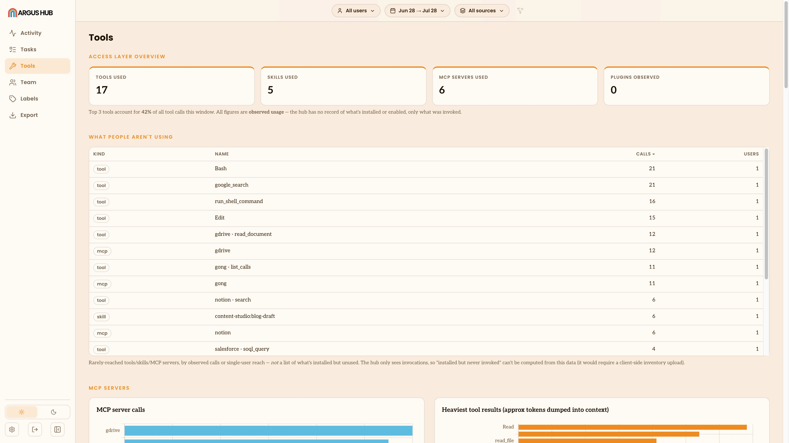

# Argus Hub: Tools

Argus Hub's Tools view covers the same ground as the single-client
[Tools view](/metric-views#tools), skills, tools, MCP servers and plugins,
aggregated across everyone syncing to the Argus Hub, plus a handful of sections
that only make sense once you're looking at more than one person's usage.

The same filter bar as [Activity](/argus-hub/activity) applies here: date range,
source and group.

## Access layer overview

A stat row for the window: how many distinct **tools**, **skills**, **MCP
servers** and **plugins** were used at all. A note below it calls out what
share of tool calls the top three tools account for, and how many MCP
servers make up the long tail beyond the heavily-used ones.

## What people aren't using

A ranked table of the least-reached tools, skills and MCP servers, by call
count and by how few distinct people ever use them. Unlike the
single-client Tools view, Argus Hub only sees what's actually invoked. It has no
visibility into what's installed but never touched, so this section is
strictly about low or single-person usage, not an enabled-but-unused
comparison.

## MCP servers

Two charts: calls per [MCP server](/terminology#mcp-server), and the
heaviest tool results by approximate tokens returned into context. A
server with high calls and a low tokens-per-call is cheap and popular; one
with a high tokens-per-call and few distinct users is likely flooding one
person's context, and worth a look before anyone else picks it up. MCP
tools render as `server · tool`, so you can tell which server a heavy
result came from at a glance.

## Tool friction

A table of tools paired with an unusual rate of non-normal stop reasons
(errors, timeouts and the like). It only appears once enough of the
window's sessions report a stop reason to make the rate meaningful, since
a handful of sessions would make any single tool look worse than it is.

## Skills

The organization's top [skills](/terminology#skill) by tokens, plus how
that use breaks down over time. The table underneath lists each skill's
invocations, distinct users and sources, which is what separates a skill
the whole team leans on from one person's habit.

## Tools

The organization's top [tools](/terminology#tool) by call count, grouped
by category, alongside a full table of every tool with its calls,
sessions, users and sources.

## Plugins

Argus Hub can only report a plugin as **used** or **not observed** in the
window. It runs server-side with no local install to inspect, so it can't
tell you a plugin is enabled but unused the way the single-client view
does. See [Tools](/metric-views#tools) for that distinction; Argus Hub can only
show what actually got used, and by how many people.

## Shared vs. solo

Which tools, skills and MCP servers are used by three or more distinct
people, versus used by only one. Like the per-user rankings elsewhere in
Argus Hub, this stays hidden until the organization has enough people syncing
that singling one out wouldn't be identifying. It's a quick way to spot a
tool worth promoting to the whole team, or one that's meant to stay
personal.

## Comparing sources

Once more than one [source](/terminology#source) is syncing, a side-by-side
comparison of tool-category mix and top tools, skills and MCP servers by
source, since raw tool names differ across agents (Claude Code's `Read` and
`Bash` versus Codex's `read_file` and `run_shell_command`, for example).
Categories give you a fair comparison where names don't.
