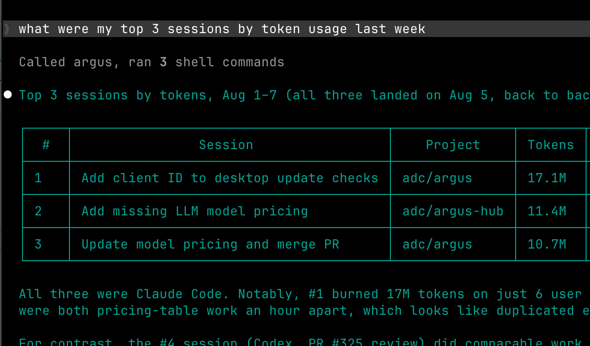

# Connect Your Agent

Argus keeps a local [index](/terminology#index) of your agent
[sessions](/terminology#session), but until now only you could see it. The
**agent access** endpoint lets AI agents on your computer query that data
themselves, so you can ask things like "what did I work on last week?" or "which
projects cost the most this month?" and the agent answers from your own work
history.

Agents connect over [MCP](/terminology#mcp-server), the standard protocol for
giving agents tools. Argus serves a local MCP endpoint at
`http://127.0.0.1:4242/mcp` whenever the app is running, with six read-only
tools. It can't change anything, and it never sends your data anywhere itself.
Local agents connect without a token. A container or another computer needs a
bearer token.

## Connect

The endpoint runs whenever Argus does, so start with the app (or
`npx @agentdeploymentco/argus run` if you use the command line). Then point your
agent at the URL. In Claude Code:

```bash
claude mcp add --transport http argus http://127.0.0.1:4242/mcp
```

[MCP Server](/mcp-server#setup) has the equivalent for Claude Cowork, Codex,
Cursor, Gemini CLI, VS Code and anything else that speaks MCP.

### Connect a Docker container

Bind the CLI to an address the container can reach, then set a token on the
machine running Argus:

```bash
export ARGUS_MCP_TOKEN="use-a-long-random-value"
npx @agentdeploymentco/argus run --host 0.0.0.0 --read-only
```

Configure the container's MCP client with the matching `Authorization: Bearer`
header. Docker Desktop containers usually reach the host at
`http://host.docker.internal:4242/mcp`. On Linux, use the host address exposed
to the container. A remote client without the token cannot use `/mcp`, even if
it sends `Host: localhost`.

Once connected, ask in plain language. "What did I work on last week?" has the
agent search your sessions. "How much did I spend in March?" reads your usage
totals. "Where am I getting interrupted most?" reads your session health.

## What agents can ask

<div class="screenshot">



</div>

| Tool | What it answers |
|---|---|
| `search_sessions` | Find sessions by text, file, date range, agent or project. |
| `get_session` | One session's detail: title, summary, tasks and outcomes, tokens and cost. |
| `get_session_transcript` | The conversation itself, prompt by prompt. Off by default; see below. |
| `usage_summary` | Token and cost totals by day, model, agent or project. |
| `tool_usage` | Which tools, tool categories, MCP servers and skills your agents used. |
| `health_summary` | Friction signals (interruptions, rejections, compactions) and Argus's recommendations. |

[MCP Server](/mcp-server#what-agents-can-ask) covers what each tool takes and
returns, with examples.

## Transcript access

Session transcripts are the one sensitive piece. Session titles, totals and task
outcomes are safe summaries, but a transcript holds the full text of what you
and the agent said, and reading one sends that text into the agent's model
provider's context. So the transcript tool ships **off**:

- **Let agents query Argus** (on by default) serves the endpoint and every tool
  except transcripts.
- **Let agents read session transcripts** (off by default) adds the transcript
  tool. Turn it on only if you're comfortable with an agent reading your
  conversations.

Both live under **Settings → Agent access** and apply the moment you flip them,
no restart. Turning **Let agents query Argus** off closes the endpoint entirely.
Transcripts also need Argus to be keeping session text in the first place, which
is the default; see [`retainText`](/settings-reference#app-and-general-settings).

## Without MCP

If your agent or script doesn't speak MCP, the same data is available over plain
HTTP and the command line. See
[MCP Server](/mcp-server#without-mcp) for both.
