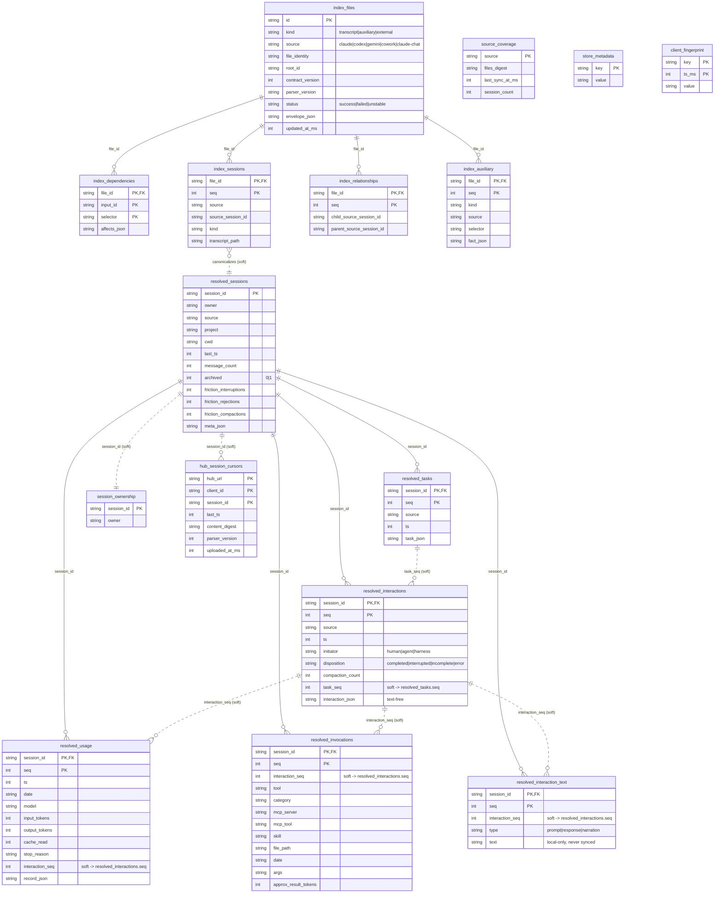

# Database schema (`argus.db`)

Argus's local store is a single SQLite database (`argus.db`, under `$ARGUS_DATA_DIR`). It is written
**only** by the indexing pipeline (`Discover → Parse → Reconcile → Interpret → Materialize`; see
[architecture.md](./architecture.md)) and read by the serve/sync paths. It is fully re-derivable from
the transcripts on disk **except** archived (off-disk) sessions and computed interpretations, which is
why schema changes ship real forward-only `MIGRATIONS` rather than rebuilds.

The tables fall into three tiers plus a small operational set:

1. **`index_*` — the structural index.** A thin index of the files on disk: enough to detect change
   (fingerprints/envelopes) and map files → sessions/relationships. It deliberately holds **no** heavy
   per-message content; a touched session is re-materialized by re-parsing its files.
2. **`resolved_*` — the read model.** The trusted, materialized content every reader hits: sessions,
   the interaction spine, per-turn usage, per-tool invocations, tasks, and (opt-in, local-only)
   retained conversation text.
3. **`source_coverage` / `session_ownership` — freshness & ownership.** Per-source freshness
   attestation and which producer owns each canonical session.
4. **Operational / sync.** `store_metadata` (key/value bag), `client_fingerprint` (append-only
   observations), and `hub_session_cursors` (per-Hub upload cursors).

## Entity-relationship diagram

Solid lines are **enforced foreign keys** (`ON DELETE CASCADE`). Lines labelled **(soft)** are
in-application joins that are *not* enforced by a SQL `FOREIGN KEY` — they join on an integer ordinal
(`interaction_seq`, `task_seq`) scoped within a session, or on `session_id`, exactly as the existing
leaf tables already relate (`resolved_usage`/`resolved_invocations` carry `interaction_seq`, never an
FK to `resolved_interactions`).

`source_coverage`, `store_metadata`, and `client_fingerprint` have no relationship lines: they are
keyed by `source` / `key` and joined to nothing. `hub_session_cursors` and `session_ownership`
reference a `session_id` but carry no enforced FK to `resolved_sessions` (cursors must survive a
session momentarily dropping off disk).

---

## Tier 1 — the structural index (`index_*`)

A thin index over the files discovered on disk. Its job is change detection and file→session mapping;
it stores none of the heavy content (that is re-parsed into `resolved_*` on demand). Everything cascades
from `index_files`.

### `index_files`
One row per discovered file (a transcript, an auxiliary input like `history.jsonl`, or an external
import). `id` is the stable file id. `file_identity` + `envelope_json` + the `parser_version` /
`contract_version` form the fingerprint used to decide whether a file changed; `status` records the
last parse outcome (`success` / `failed` / `unstable`) and `invalidation_reason` why a cached parse
was dropped. `import_provenance_json` records where an imported file came from. The parent of every
other `index_*` table.

### `index_dependencies`
Inputs a file's parse depends on (e.g. an auxiliary file that feeds a transcript), so a change to an
input invalidates the dependent. PK `(file_id, input_id, selector)`; `affects_json` scopes what the
dependency touches. FK → `index_files`.

### `index_sessions`
Maps each file to the session(s) it contains: `source` + `source_session_id` identify the session, and
`transcript_path` points at the file on disk. This is the bridge from the structural index to the
canonical `resolved_sessions` (a soft link — the producer canonicalizes children onto parents). PK
`(file_id, seq)`, FK → `index_files`.

### `index_relationships`
Subagent parent/child links discovered during parse (`child_source_session_id` →
`parent_source_session_id`), so subagent transcripts fold onto their parent session at reconcile. PK
`(file_id, seq)`, FK → `index_files`.

### `index_auxiliary`
Small auxiliary facts reconstructed from rows rather than re-parsed each run (e.g. Claude history
first-prompts, Gemini project roots). `kind` + `selector` + `fact_json` carry the fact; it feeds
reconcile (cwd / first-prompt) and the changed signal. PK `(file_id, seq)`, FK → `index_files`.

## Tier 2 — the read model (`resolved_*`)

The trusted content store. `resolved_sessions` is the root; every other `resolved_*` table is a leaf
that FKs to it with `ON DELETE CASCADE`, so re-materializing a session (delete + re-insert) replaces
all of its rows atomically. **Within a session, the leaves relate to the interaction spine and to
tasks by integer ordinals (`interaction_seq`, `task_seq`), not enforced FKs** — task/interaction-grain
rollups are SQL joins through those ordinals.

### `resolved_sessions`
One row per canonical session. Carries identity (`session_id`, `owner`, `source`, `project`, `cwd`),
timestamps, `message_count`, the `archived` flag (1 = retained but no longer on disk), the promoted
friction signals (`friction_interruptions` / `_rejections` / `_compactions` / `_turns`,
`last_interruption_ms`; NULL where the source can't observe friction), and `meta_json` (the
authoritative `SessionMeta`). The root of the read model.

### `resolved_usage`
One row per usage-bearing turn (the provider's metering grain: Claude `message.usage`, Codex
`token_count`). `record_json` is the authoritative `MessageRecord`; the token columns
(`input_tokens`, `output_tokens`, `cache_read`, `cache_write_5m`, `cache_write_1h`), `model`,
`attribution_skill`, and `stop_reason` are promoted out of it so token/cost breakdowns are SQL
`GROUP BY` (cost is priced per-model in JS, not stored). `interaction_seq` soft-links the owning
interaction. PK `(session_id, seq)`, FK → `resolved_sessions`.

### `resolved_interactions`
The interaction spine: one row per interaction (`prompt → loop → response`). `initiator`,
`disposition`, and `compaction_count` are promoted columns backing the friction/outcome rollups;
`task_seq` soft-links the owning task (**task membership lives only here**); `interaction_json` holds
the full fact (including prompt/response slot positions) and is **always text-free**. PK
`(session_id, seq)`, FK → `resolved_sessions`. Soft parent of `resolved_usage`,
`resolved_invocations`, and `resolved_interaction_text` via their `interaction_seq`.

### `resolved_interaction_text` (#120)
Opt-in (default-on), **local-only** retained conversation text. Tall, shaped like the other leaves:
`seq` is the table's own running per-session ordinal (timeline / chunk order), `interaction_seq`
soft-links the owning interaction, and `type` names the chunk's role (`prompt` / `response` today,
`narration`-ready — a controlled vocabulary stored as plain `TEXT`, so new kinds need no schema
change). A reader rebuilds the dialogue with `ORDER BY seq`, grouped by `interaction_seq`. Kept out of
`interaction_json` and never read by the push path, so retained text is **never synced** by
construction. PK `(session_id, seq)`, FK → `resolved_sessions`. See
[configuration.md](./configuration.md#session-text-retention).

### `resolved_invocations`
One row per tool invocation (call + its paired result), so `byTool` / `byToolCategory` /
`byMcpServer` / `skillInvocations` / heaviest-results are `GROUP BY` queries. Carries `tool`,
`category`, the MCP facets (`mcp_server`, `mcp_tool`), `skill`, `file_path`, the denormalized owning
`date`/`cwd` (for windowed breakdowns), the `args` sample, and `approx_result_tokens` (the folded
result size). `interaction_seq` soft-links the owning interaction. PK `(session_id, seq)`, FK →
`resolved_sessions`.

### `resolved_tasks`
One row per task ("chapter", an Interpret output). `task_json` is the full `TaskFact`; `ts` orders
them. Interactions point at their task via `resolved_interactions.task_seq` (the soft parent
relationship runs task → interactions). PK `(session_id, seq)`, FK → `resolved_sessions`.

## Tier 3 — freshness & ownership

### `source_coverage`
Per-source freshness attestation: `files_digest` + `last_sync_at_ms` + `session_count` let a reader
know whether the store is current for a source. Keyed by `source`; no joins.

### `session_ownership`
Which producer `owner` owns each canonical `session_id` (native producers win over dependent
importers). One row per session; soft-related to `resolved_sessions` by `session_id`.

## Operational / sync

### `store_metadata`
Generic single-row-per-key string bag for store-wide scalars (e.g. the per-install `client_id`), so
new scalars don't each need a table + migration. Keyed by `key`.

### `client_fingerprint`
Append-only log of client-fingerprint observations (e.g. git email, OAuth email) as `(key, value,
ts_ms)` tuples; a repeat write of the same value for a key is suppressed so only changes accumulate.
Used to register clients with the dashboard backend. PK `(key, ts_ms)`.

### `hub_session_cursors`
Per-Hub upload cursors: a row means this `client_id` got a successful response from `hub_url` after
sending `session_id` at the recorded `last_ts` / `content_digest` / `parser_version`, so re-syncs skip
unchanged sessions and pick up reindexed ones. PK `(hub_url, client_id, session_id)`; references
`session_id` without an enforced FK.

## Schema version & migrations

`PRAGMA user_version` holds the schema version (currently **18**) and `PRAGMA application_id`
(`0x41524753`, "ARGS") tags the file as an Argus store. Upgrades run forward-only `MIGRATIONS` in
`src/store/store.ts`, each a `{ to, sql }` step applied in a transaction that bumps `user_version`, so
a partial upgrade never leaves a half-migrated store. Fresh stores are created from `CREATE_SCHEMA_SQL`
(the shared DDL the latest migration step mirrors). The store is re-derivable from disk except archived
sessions and computed interpretations, which migrations preserve.
