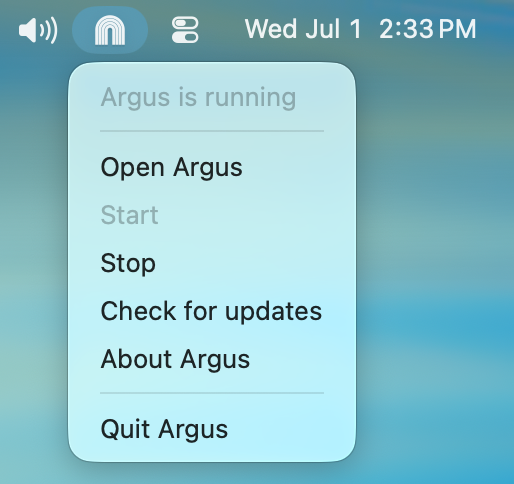

# Download

Argus is a native desktop app that lives in your menu bar on macOS or your system
tray on Windows. It keeps your local [session](/terminology#session) data current
and opens Argus in your browser, with no separate setup.

<DownloadButtons location="download_page" />

## Install on macOS

1. Open the downloaded `.dmg`.
2. Drag **Argus** into your **Applications** folder.
3. Eject the disk image, then launch Argus from Applications (or Spotlight).

Once it's running, look for the Argus icon in your menu bar. Open it to see your
usage.



::: tip If macOS blocks the app on first launch
If you see a warning that the app can't be opened, right-click (or
Control-click) **Argus** in Applications and choose **Open**, then confirm.
You only need to do this once. Alternatively, open **System Settings →
Privacy & Security** and click **Open Anyway**.
:::

## Install on Windows

1. Run the downloaded installer (its name ends in `x64-setup.exe`). It sets
   Argus up for your user account, so no administrator sign-off is needed.
2. When it finishes, Argus starts and its icon appears in your system tray, in
   the bottom-right corner of your screen (it may be tucked behind the `^`
   arrow). Open it to see your usage.

On a Windows ARM device (a Snapdragon Surface, for example), download the
`arm64` installer from the
[GitHub releases](https://github.com/Agent-Deployment-Co/argus/releases/latest)
page instead.

::: tip If Windows warns about the installer
If Microsoft Defender SmartScreen shows "Windows protected your PC", click
**More info**, then **Run anyway**. A fresh release can trigger this until
Windows has seen enough downloads to trust it.
:::

## Argus starts when you sign in

After the first launch, Argus starts on its own whenever you sign in to your
computer, so your data stays current even after a restart. Turn that off under
**Startup** in [Settings](/settings) if you'd rather launch it yourself.

## Updating

Argus checks for new versions and updates itself in the background, so you stay
on the latest release without re-downloading. You can always grab the most
recent build from this page or from the
[GitHub releases](https://github.com/Agent-Deployment-Co/argus/releases).

## Prefer the command line?

You don't need the app to use Argus. If you'd rather run it directly, the
command-line tool works through `npx` (Node.js 20.17 or newer):

```bash
npx @agentdeploymentco/argus serve --open
```

See [Quick Start](/) for what Argus shows you.
