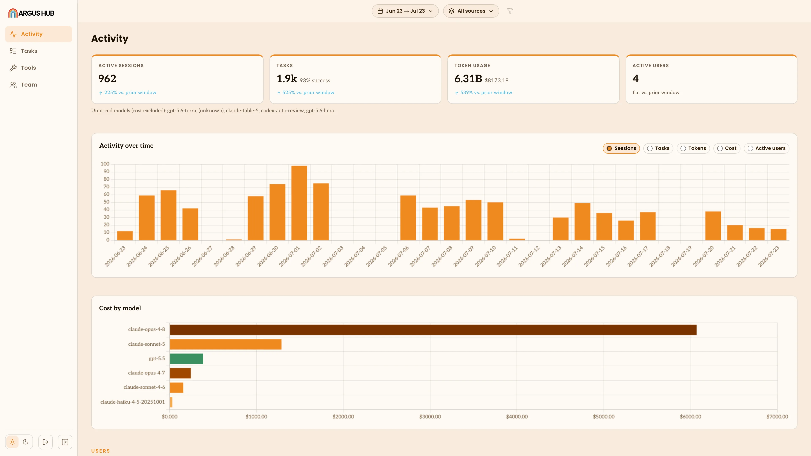

# Activity

Activity is Hub's home view: how much agent work the organization did in the
window you're looking at, and how that work is spread across people and
[sources](/terminology#source). It opens with headline totals, then breaks
those totals down over time, by model, by person and by source.

## Filters

A filter bar sits above the view:

- **Date** narrows the window, with quick presets or your own From and To
  dates. Hub defaults to the last 30 days.
- **Sources** narrows to one agent.
- **Group** narrows to one [group](/hub-team#groups) of people, or to
  **Ungrouped** for people with no group assigned. It only appears once at
  least one person has been put in a group.

Activity has no per-person filter of its own — to see one person's usage,
open their row in the [Team](/hub-team) table, which takes you to their own
activity page (below). A Reset button clears the filters back to the
30-day, all-sources default.

## Headline totals

Four stat cards open the view: **Active sessions**, **Tasks** (with the
success rate among tasks that reached a clear outcome), **Token usage**
(with estimated cost), and **Active users**. Every card carries a trend
line comparing the current window to the window immediately before it, of
the same length — `+12% vs. prior window`, a flat reading, or nothing at
all if there's no prior window to compare against yet.

## Activity over time

A daily bar chart, with a toggle to switch what it plots: Sessions, Tasks,
Tokens, Cost or Active users. Every day in the window gets a bar, including
days with no activity, so a quiet stretch reads as a gap rather than
disappearing from the axis.

## Cost by model

A horizontal bar chart of the window's spend, broken down by
[model](/terminology#model). Each bar's tooltip shows the dollar amount,
its share of total spend and the tokens behind it. Models Argus can't price
are excluded here and called out in a note below the headline totals
instead.

## Users

Per-user rankings stay hidden until the organization has at least three
people syncing, so a small team never gets singled out by name. Once
there's enough of a cohort, this section shows a **Most active** and
**Least active** top-5, each row tagged by how recently that person has
synced:

- **Active** — syncing and scoring normally.
- **Idle** — still syncing, but scoring low this window.
- **Silent** — hasn't synced in 3 or more days.

Rank is an **activity score** from 0–100, blending active days, sessions
and tokens, each measured against the busiest person in the window and
weighted equally. Every raw number behind the score is in the full table
underneath, sorted by any column, so the ranking is never a black box.
Click a name, in the mini-lists or the table, to open that person's own
activity page — the same view a single Argus client shows for their own
usage (see [Sessions](/sessions), [Metric Views](/metric-views)), scoped to
them.

## Sources

A table ranking each agent by sessions, distinct users, tokens, cost and
task success rate, sorted by sessions descending. A note calls out the
least-adopted source in the window — a candidate for more onboarding, or
for retiring if it isn't earning its keep.
