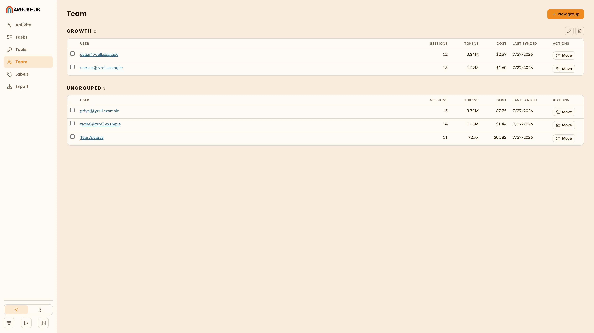
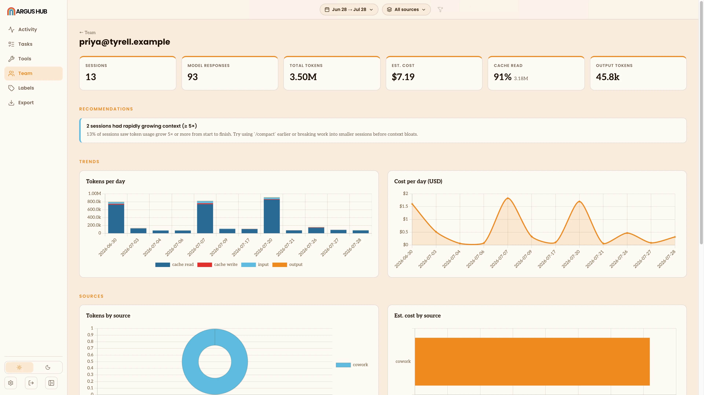

# Team

Team is the roster: every person whose Argus has ever synced to this Hub,
what they've used, and when they last synced. It's also where you organize
people into groups so Activity, Tasks and Tools can be scoped to a team
rather than the whole organization.

## The table

People are listed in sections, one per group plus a trailing **Ungrouped**
section, each sorted alphabetically by name. There's no column sort here,
since the point of this view is the roster, not ranking. Each row shows
sessions, tokens, estimated cost and when that person last synced. Click a
name to open their own activity page: the same Activity/Projects/Tools/
Health view the single-client Argus app shows (see [Overview](/overview),
[Metric Views](/metric-views)), scoped to their usage alone.

## Groups

Groups are how you scope Hub's other views (Activity, Tasks, Tools) to a
team rather than the whole organization: a department, a pod, whatever
division makes sense for you. Group names must be unique on a Hub.

- **Create a group** from the button above the table, giving it a name.
- **Rename** or **delete** a group from its section header. Deleting a
  group doesn't remove its members, it only ungroups them, moving them
  back to the **Ungrouped** section. Nobody's sync history or usage is
  affected.
- **Move one person** with the row action next to them: a popover lists
  every group, lets you search or create a new one on the spot, and
  applies it immediately. **Clear** removes them from any group.
- **Move several at once** by selecting their checkboxes (across sections)
  and using the bulk action bar that appears, choosing a target group or
  **Ungrouped**.

Once at least one person has a group, the Group filter appears on
[Activity](/hub-activity), [Tasks](/hub-tasks) and [Tools](/hub-tools),
plus an **Ungrouped** option for anyone not yet assigned.

