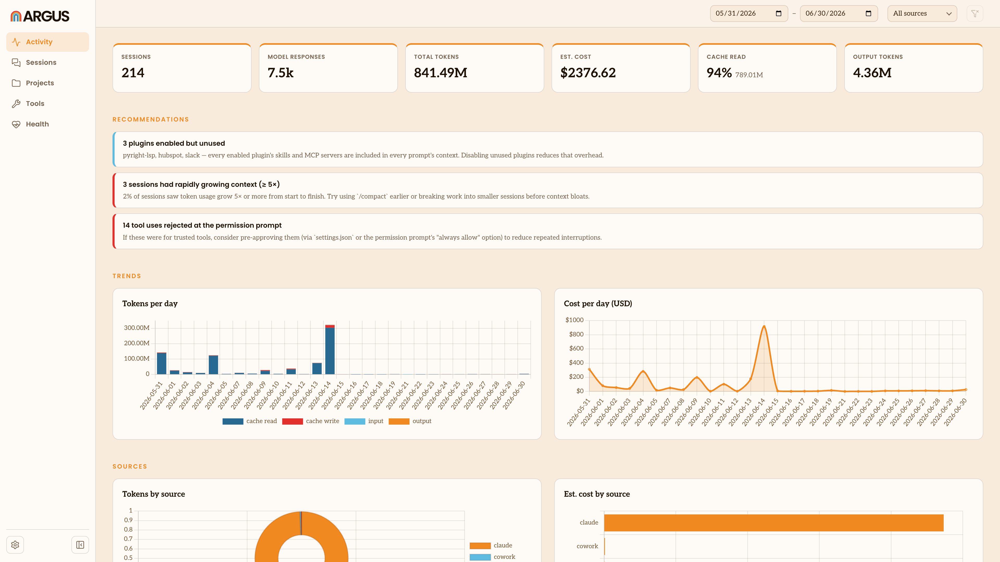

# Argus Quick Start

Argus analyzes your AI agent usage to help you be more productive with AI. It's built for non-coders using agents to do business tasks like account research, drafting content, editing spreadsheets and building workflows.

Argus indexes [sessions](/glossary#session) from your AI [agents](/glossary#agent) like Claude and Codex, bringing all your AI agent work into an one app running locally on your computer.



### Argus is always local, private, secure and free
All Argus data is stored locally on your own computer and never uploaded unless you choose to [sync](/glossary#sync) usage data to an [Argus Hub](/glossary#argus-hub) run by your company. Argus is a [free open source project](https://github.com/Agent-Deployment-Co/argus) from [The Agent Deployment Company](https://www.agentdeployment.co).

## Get started

Install the desktop app and you're set: it keeps your usage up to date and opens
your [dashboard](/glossary#dashboard) in your browser, with no extra setup. See
[Installation](/installation) to download it for Mac.

Prefer the command line? Argus also runs as a command-line tool through `npx`
(needs Node.js 20.17 or newer):

```bash
npx @agentdeploymentco/argus serve --open
```

This starts a local dashboard (default `http://localhost:4242`) and opens it.
Press `Ctrl-C` to stop. Nothing leaves your machine.

## What the dashboard shows

- [Tokens](/glossary#token) and estimated [cost](/glossary#cost) over time
- A breakdown by [source](/glossary#source): Claude Code, Claude Cowork, Claude Chat, Codex, and Gemini CLI
- The [skills](/glossary#skill), [tools](/glossary#tool), [MCP servers](/glossary#mcp-server), [plugins](/glossary#plugin), [models](/glossary#model), and [projects](/glossary#project) you use most
- The tools that send the most content back into your agent's context
- Per-[session](/glossary#session) time, tokens, cost, and prompts

## Where to go next

- **[Installation](/installation):** install the Mac app, or run the command-line tool through `npx`.
- **[Configuration](/configuration):** settings, flags, and environment variables.
- **[Argus Hub](/argus-hub):** collect usage across a team and view an org-wide dashboard.
