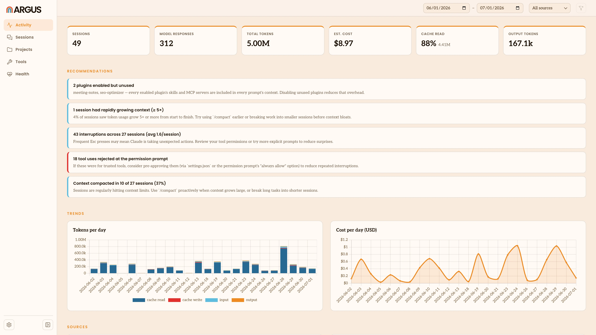

# Quick Start

Argus is a desktop app that helps you find and fix wasted agent work. It's built for people using AI for business tasks. These tasks are usually more open-ended and need more external context than coding, making for some frustrating agent interactions. Argus analyzes your AI [sessions](/terminology#session) to identify those costly, repetitive or unsuccessful tasks. It works with Claude Cowork, Claude Chat, Claude Code, ChatGPT Work and Codex.

<DownloadButtons center label="Download:" location="quick_start" />

Want to look around first? Open the [live demo](https://argus-demo.agentdeployment.co), a read-only copy of Argus filled with sample data.

## Local, private and free

Argus stores all its data on your own computer and never uploads it unless you choose to [sync](/terminology#sync) usage data to an [Argus Hub](/terminology#argus-hub) run by your company. Argus is a [free open source project](https://github.com/Agent-Deployment-Co/argus) from [The Agent Deployment Company](https://www.agentdeployment.co).

## Features

Open Argus and it shows your agent usage from every angle:

- [Tokens](/terminology#token) and estimated [cost](/terminology#cost) over time
- A breakdown by [source](/terminology#source): Claude Cowork, Claude Chat, Claude Code, ChatGPT Work, Codex and Gemini CLI
- The [skills](/terminology#skill), [tools](/terminology#tool), [MCP servers](/terminology#mcp-server), [plugins](/terminology#plugin), [models](/terminology#model) and [projects](/terminology#project) you use most
- The tools that send the most content back into your agent's context
- Per-session time, tokens, cost and prompts

## Next steps

- **[How It Works](/how-it-works):** how Argus finds and indexes your sessions in the background.
- **[Overview](/overview):** get around the app.
- **[Download](/download):** get the desktop app.
- **[Argus Hub](/argus-hub):** collect usage across a team and see an org-wide view.
