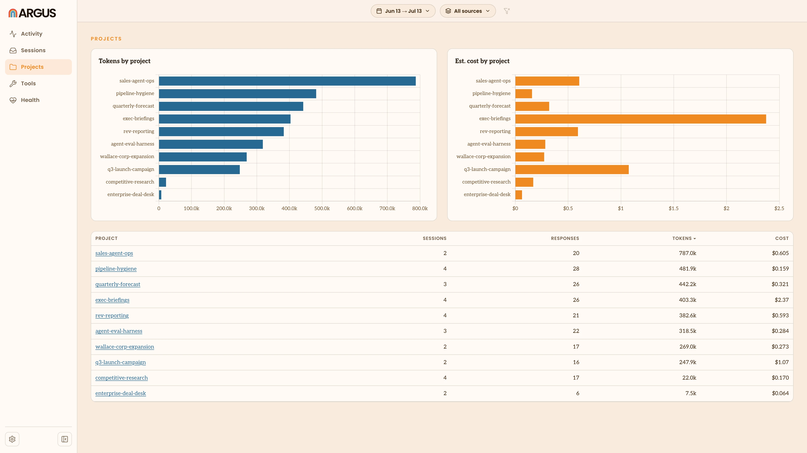
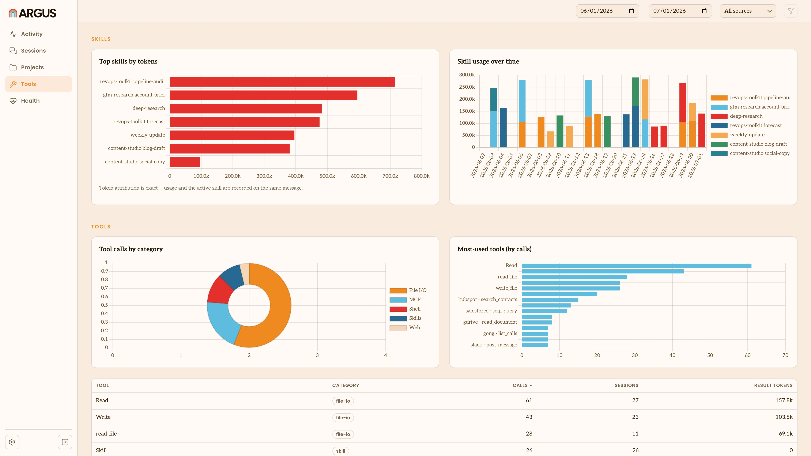
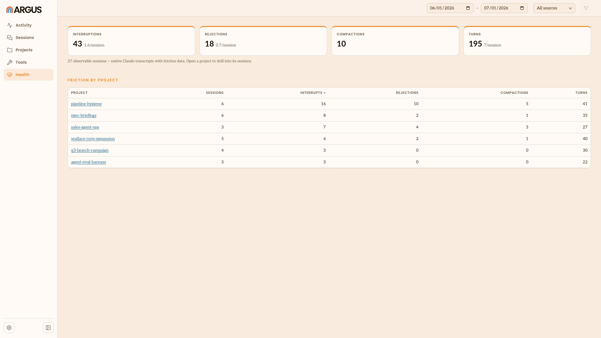

# Metric Views

Argus rolls your usage up several ways, one per view in the left nav. This page
explains what the numbers in each view mean. All of them respect the date range
and [source](/terminology#source) filter at the top of the app (see
[Overview](/overview)).

## Activity

The home view. It opens with headline totals for the range you're looking at:

- **Sessions** and **Model responses**: how many [sessions](/terminology#session)
  you ran and how many replies your agents sent.
- **Total tokens** and **Est. cost**: how many [tokens](/terminology#token) moved
  through your agents and the estimated [cost](/terminology#cost).
- **Cache read**: the share of input tokens served from cache. A higher number
  means more of your context was reused rather than reprocessed, which is
  cheaper.
- **Output tokens**: how many tokens your agents wrote back.

Below the totals:

- **Recommendations** are things Argus noticed that may be worth acting on, like
  [plugins](/terminology#plugin) you've enabled but never use, or sessions where
  context grew unusually fast.
- **Trends** plot your tokens per day and cost per day across the range.
- **Sources** breaks your usage down by agent, as charts and a table you can
  sort.
- **Models** shows your token use by [model](/terminology#model) over time.

## Projects

Your usage grouped by [project](/terminology#project), the folder an agent was
working in. Charts rank your projects by tokens and by cost, and a table lists
them all with their session, response, token and cost totals. Click a project to
open its sessions.

## Tools

What your agents actually reach for, in four parts:

- **Skills**: the [skills](/terminology#skill) your agents used most, by tokens, and
  how that use breaks down over time.
- **Tools**: the [tools](/terminology#tool) your agents called most, grouped by
  category, with how many times each was called and how much content it returned
  into the agent's context.
- **MCP servers and tool output weight**: which
  [MCP servers](/terminology#mcp-server) your agents lean on, and which tools return
  the most content back into context. The heaviest ones are worth trimming, since
  everything a tool returns takes up space the agent has to read.
- **Plugins**: the [plugins](/terminology#plugin) you have installed and whether each
  is used, enabled but unused, or disabled. The enabled-but-unused ones are
  candidates to turn off, since every enabled plugin adds to what an agent loads
  before you even prompt it.

## Health

Signs of [friction](/terminology#friction) in your sessions: how often you
interrupted an agent, how often you declined a tool action it wanted to take, how
often a session's context had to be compacted and how long turns took. Totals sit
up top and a table breaks the same signals down by project.

Argus measures friction for Claude sessions only, so this view stays empty until
you have some. Codex and Gemini sessions don't report these signals.

