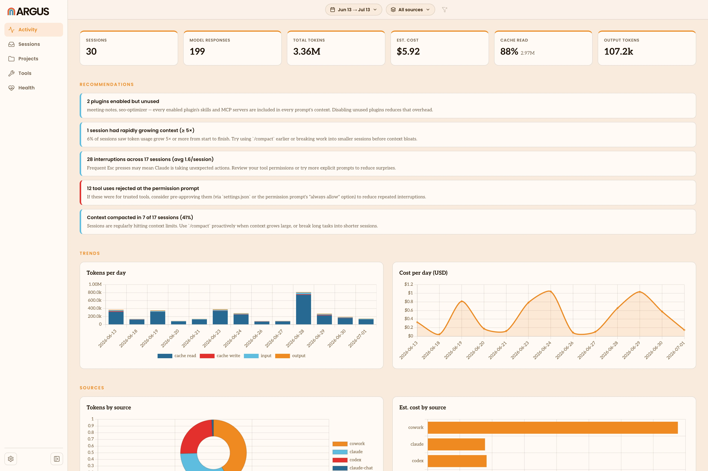

# Overview

Argus opens in your browser and brings all your AI agent work into one place.
This page covers how to get around: the views in the left nav, and the filter
that shapes what each one shows.

## The left nav

The nav down the left side switches between views, top to bottom:

- **Activity** is the home view: your usage at a glance, with headline totals,
  recommendations and trends over time.
- **Sessions** is where you read individual [sessions](/glossary#session) in
  depth. See [Sessions](/sessions).
- **Projects** groups your usage by [project](/glossary#project).
- **Tools** shows the [skills](/glossary#skill), [tools](/glossary#tool),
  [MCP servers](/glossary#mcp-server) and [plugins](/glossary#plugin) your agents
  use.
- **Health** surfaces [friction](/glossary#friction) in your sessions. It's
  available once you have Claude sessions to measure.

Activity, Projects, Tools and Health are the metric views, explained in
[Metric Views](/metric-views). A gear icon at the bottom opens
[Settings](/settings).

## Filtering what you see

Two controls at the top shape every view: a date range (a From and a To date)
and a [source](/glossary#source) filter. Set them once and they carry across the
views, so you can focus on the last week, or on a single agent, without setting
them again each time. Argus starts on the last 30 days and all sources, and a
Reset button returns to that.

## Moving between views

The views link into each other. Click a project on Projects, or a source on
Activity, and Argus opens the Sessions view already filtered to it, so you can go
from a total straight to the sessions behind it.
