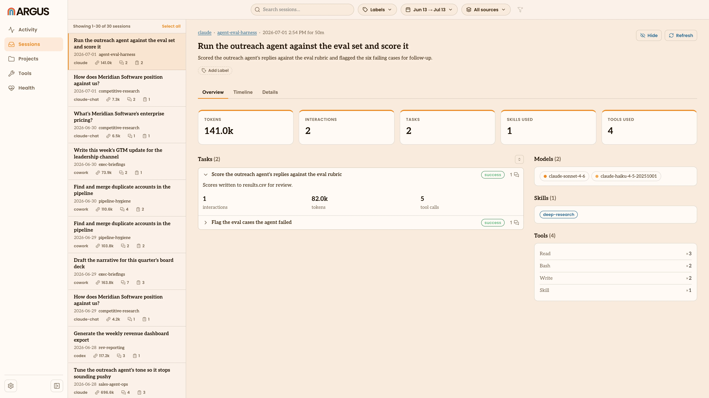
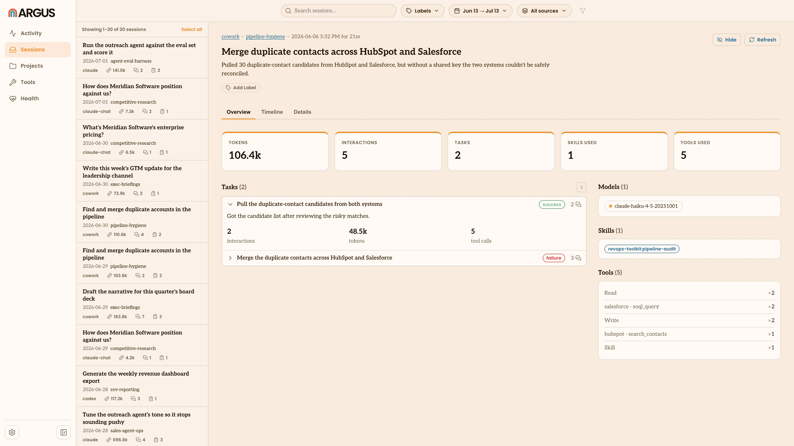

# Sessions

The Sessions view is where you see how you actually work with your agents, one
[session](/glossary#session) at a time, rather than as totals. Open any session
to read what happened in it.

## Browsing sessions

The list down the left shows your sessions, newest first. Each entry shows its
title (taken from your opening prompt), when it ran, its project and its token
and cost totals. Three controls narrow the list:

- **Filter sessions** searches titles, projects and sources as you type.
- **Sort** orders the list by most recent, most [tokens](/glossary#token) or
  highest [cost](/glossary#cost).
- **Argus sessions** toggles whether Argus's own background sessions show up.
  They're hidden by default.

If you arrived by clicking a project or [source](/glossary#source) on another
view, the list is already narrowed to it, shown as a pill you can remove.

## Inside a session

Open a session and the right pane shows what Argus indexed about it, starting
with when it ran and its totals: tokens, estimated cost, how many messages you
and the agent sent, how long it lasted and how many turns it took.

Below the totals:

- **Tasks** breaks the session into the [tasks](/glossary#task) you worked on and
  how each one went. Tasks appear once you turn on task interpretation in
  [Settings](/settings); until then this reads "No tasks yet."
- **Friction** counts the [friction](/glossary#friction) signals in the session:
  interruptions, tool actions you declined, compactions and turn timings. Claude
  sessions only.
- **Models**, **Skills** and **Tools used** list the [models](/glossary#model),
  [skills](/glossary#skill) and [tools](/glossary#tool) the session drew on.
- **Files touched** lists the files the agent read or changed.
- **Opening prompt** shows the first thing you asked, in full.

Click a task to open its detail drawer, with the outcome, any frustration
signals and the tools it used:

## Keeping a session current

If a session has grown since Argus last indexed it, the **Refresh** button at the
top re-reads it from disk and updates everything on the page.
