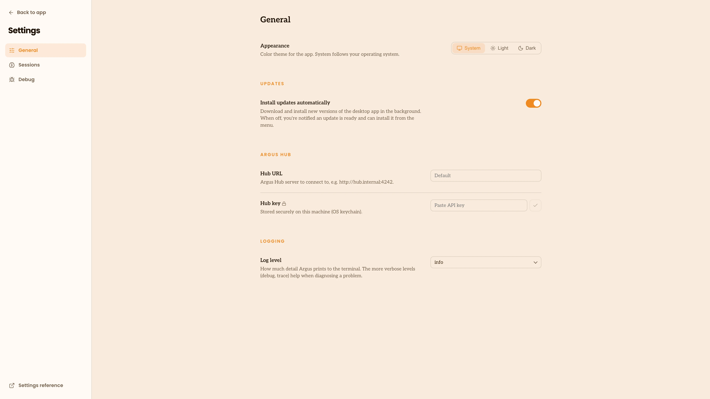
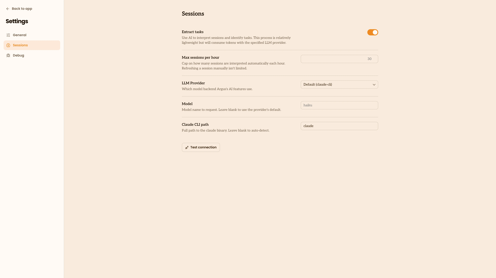

# Settings

Configure Argus from inside the app. The gear icon at the bottom of the left nav
opens Settings, grouped into a few categories.

## General

- **Appearance** sets the color theme: follow your system, or force light or
  dark.
- **Updates** controls whether the desktop app installs new versions
  automatically. With it off, Argus tells you when an update is ready and you
  install it from the menu bar.
- **Argus Hub** holds the address of your team's [Argus Hub](/terminology#argus-hub)
  and the key used to [sync](/terminology#sync) to it. Leave these blank if you
  aren't using a Hub.
- **Logging** sets how much detail Argus prints to the terminal, from `error`
  (least) through `warn`, `info`, `debug`, and `trace` (most). The default is
  `info`. A change takes effect right away, without a restart. Setting the
  `ARGUS_LOG_LEVEL` environment variable overrides this, and the app shows a note
  when it does.

## Sessions

- **Interpret sessions** turns on [session interpretation](/tasks), the pass that
  gives each [session](/terminology#session) a title and summary, groups it into the
  tasks you worked on, and judges how each one went. It's on by default. This is the
  one thing Argus does with an outside model, so turning it on reveals the model
  settings below. See [Tasks](/tasks) for what it captures and how to choose a provider.
- **Max sessions per hour** caps how many sessions Argus interprets
  automatically each hour. Refreshing a session by hand isn't limited.
- **Model provider**, **Model**, **Reasoning effort** and **Claude CLI path** choose
  which model backend does the interpretation and how hard it works. The cheap
  defaults (Claude Haiku on the local Claude CLI) are good enough out of the box; for
  sharper titles, summaries, and outcome calls, point Argus at a stronger model such
  as Claude Sonnet or Opus. Argus stores any API key in your operating system's secure
  store, never in its settings file, and a **Test connection** button confirms it works.
- **Reasoning effort** is passed straight through to the provider, so use the value
  that provider expects: `low`, `medium`, `high` (and `xhigh`, `max` on the newest
  models) for Claude and OpenAI; a thinking level for Gemini. Leave it blank for the
  provider default. The cheapest default models don't accept an effort setting, so only
  set it once you've chosen a model that supports it.

## Debug

A read-only view of where Argus reads from and writes to: its settings, the
folders it's watching and how it resolved them. Useful when something isn't
showing up and you want to see what Argus sees.

## From the command line

The app surfaces the everyday settings. A few advanced ones are set from the
command line instead, including text retention, which controls whether Argus
keeps the text of your prompts and responses on your machine (it stays local
either way). See the [CLI Reference](/cli-reference).

## Managed by your organization

If your organization manages this computer with a device-management tool (an
MDM such as Jamf or Kandji), it can set Argus settings for everyone. A managed
setting always wins: the app shows "Managed by your organization" next to it,
and changing it here or from the command line has no effect. Ask your IT team
if you need one changed.
