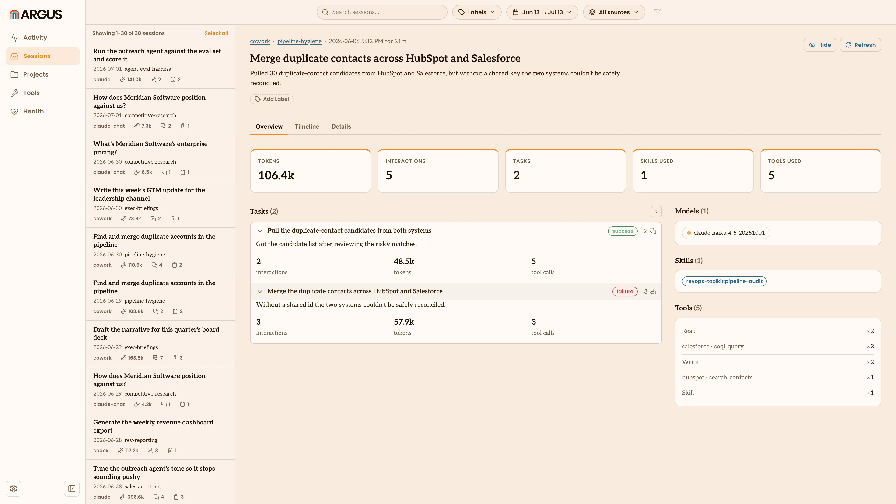

# Tasks

A task is one thing you set out to do in a [session](/terminology#session), like
researching an account, drafting a post or cleaning up a spreadsheet. Argus reads
each session with a model, groups its back-and-forth into the
[tasks](/terminology#task) you worked on and judges how each one went.

This is the one place Argus uses a model to interpret your sessions. It's what
lets you see not just how many [tokens](/terminology#token) and how much
[cost](/terminology#cost) a session used, but which of your goals succeeded,
which frustrated you and what each one took.

## What Argus captures per task

For each task it finds, Argus records:

- **A short description** of what you were trying to do.
- **An outcome**: success, failure or unclear, judged from the whole exchange
  rather than just the last message.
- **A frustration level**: none, low or high, read from signs like repeated
  re-asks, corrections or an escalating tone.
- **Signals**: short tags that back up the judgment, like "repeated re-asks" or
  "no access".
- **A one-line reason** for the outcome.
- **Its own tokens, cost and tool calls**, so you can see what each goal took,
  not just the session total.

## Where you see them

Open a session (see [Sessions](/sessions)) and its tasks are listed under
**Tasks**, each with its outcome and token count. Click one to open its detail,
with the frustration level, the signals behind the judgment, the reason and the
[tools](/terminology#tool) it used.

## How Argus builds them

Argus reads a session in two passes:

1. **It finds the tasks.** It reads your prompts and splits the session into the
   goals you pursued, combining messages that belong to the same goal and
   skipping setup and noise.
2. **It judges each one.** For every task, it reads the full exchange between you
   and the agent and decides how it turned out and how smooth it was.

This runs quietly as Argus indexes, and only on sessions that have changed.
Judging an outcome means re-reading your prompts and responses, so Argus keeps
that text in its local store. That stored text is never uploaded, though
interpreting a task does send it to the model you pick, covered below.

## Turning it on

Task interpretation is on by default. You control it in [Settings](/settings)
under **Sessions**:

- **Extract tasks** turns it on or off.
- **Max sessions per hour** caps how many sessions Argus interprets on its own,
  so a large backlog doesn't run all at once. Refreshing a single session by hand
  isn't capped.

## Choosing a model provider

Interpretation needs a [model](/terminology#model) to do the reading, and you
choose which one in the same Sessions settings. This is the only part of Argus
that sends your sessions to a model, so the choice, including whether anything
leaves your machine, is yours.

| Provider | Needs an API key | Sends task text to |
|---|---|---|
| **Claude CLI** (default) | No | Anthropic, through your Claude sign-in |
| **Claude API** | Yes | Anthropic |
| **OpenAI** | Yes | OpenAI |
| **Gemini** | Yes | Google |
| **OpenRouter** | Yes | OpenRouter, which forwards to the model |
| **Command** | No | Wherever your command sends it (a local model keeps it on your machine) |

**Claude CLI** is the default and needs no setup if you already use Claude Code.
It runs the `claude` program signed in with your existing Claude login, so there
is no separate API key to manage. Like any use of Claude, it sends the task's
text to Anthropic's models to do the reading. If Argus can't find the `claude`
program, set its location in **Claude CLI path**.

**The hosted providers** (Claude API, OpenAI, Gemini and OpenRouter) call a model
over the internet. Each needs an API key, which Argus keeps in your operating
system's secure keychain, never in its settings file. Pick a model or leave it
blank to use the provider's default, then use **Test connection** to confirm the
key works. With a hosted provider, the prompts and responses for each task are
sent to that provider to be judged. OpenRouter is a single key that forwards to
models from many providers.

**Command** runs a model or script you point it at, passing the task's text in
and reading the result back. Point it at a model that runs on your own machine
and nothing leaves your computer. This is the one way to keep interpretation
fully on your machine.

Whichever you choose, interpretation uses tokens with that provider. The default
uses your existing Claude sign-in; a provider with its own API key bills that
account for what it reads and writes.

## What stays private

Two things decide where your task data goes:

- **Syncing to a Hub.** If you [sync](/terminology#sync) usage to an
  [Argus Hub](/terminology#argus-hub), your tasks and their judgments (the
  outcome, frustration and signals) are included, so an ops leader can see them
  across a team, along with short snippets like a session's opening prompt and
  the brief evidence behind each judgment. The full text of your sessions is
  never uploaded; it stays on your machine.
- **Interpretation.** To judge a task, Argus sends its prompts and responses to
  the model provider you chose. Every provider does this over the internet,
  including the default Claude CLI, which sends the text to Anthropic. The one
  exception is a Command provider pointed at a model that runs on your own
  machine.
